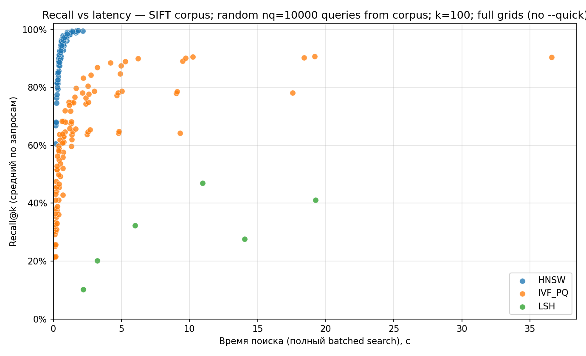
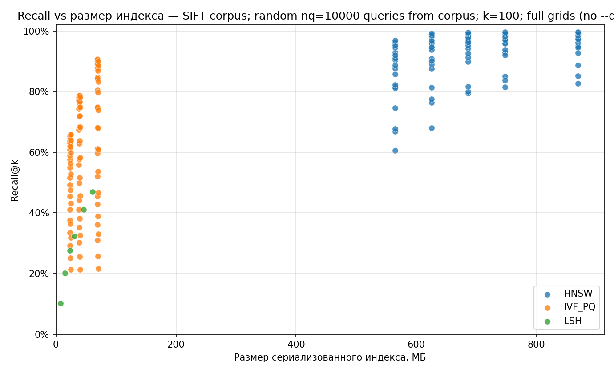
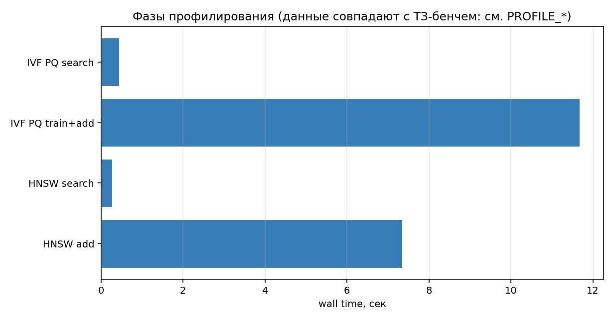
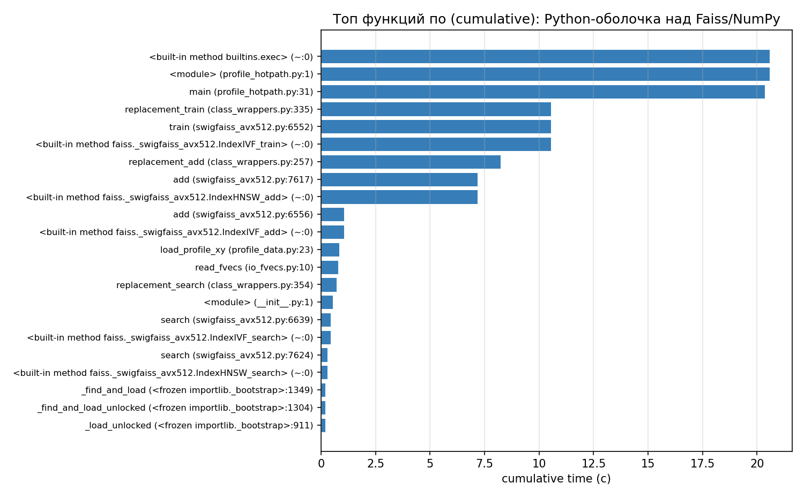
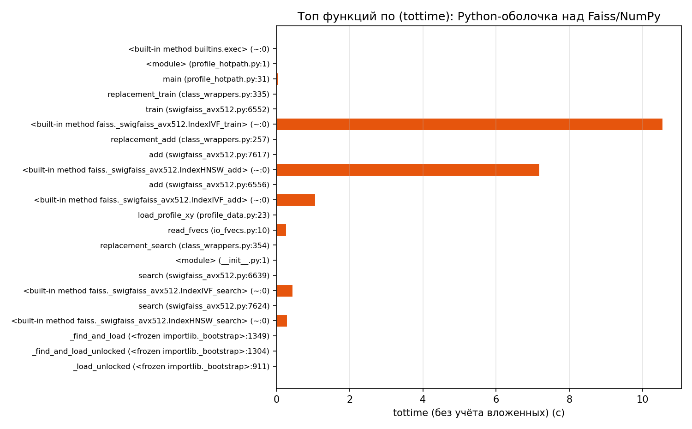
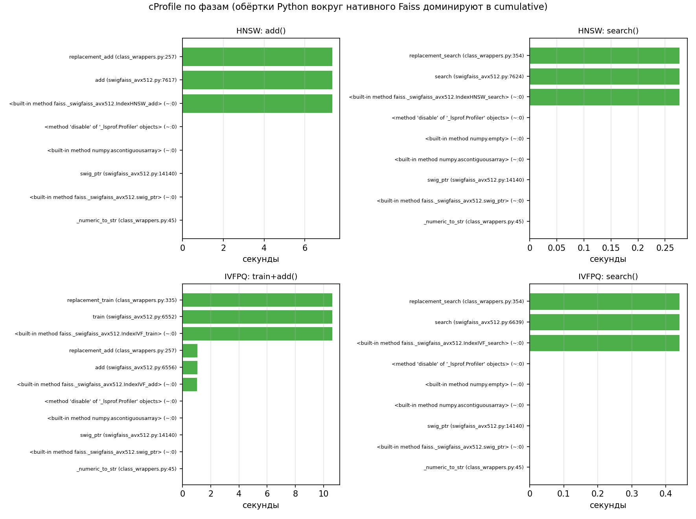
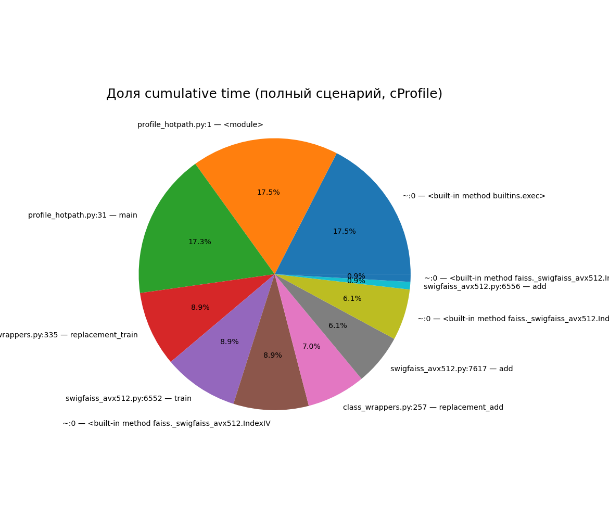

# Лабораторная №3 — Векторный поиск (IVF / HNSW / LSH), замеры качества и профилирование

**Дисциплина:** Структуры и алгоритмы в базах данных и распределённых системах  
**Тема:** Экспериментальный сравнительный анализ приближённого поиска ближайших соседей на большом наборе векторов

---

## Содержание

1. [Теоретическая часть](#1-теоретическая-часть)
   - [1.1 Задача ANN](#11-задача-ann)
   - [1.2 Ground truth](#12-ground-truth)
   - [1.3 Методы в эксперименте](#13-методы-в-эксперименте)
2. [Практическая часть](#2-практическая-часть)
   - [2.1 Датасет и окружение](#21-датасет-и-окружение)
   - [2.2 Код и воспроизводимость](#22-код-и-воспроизводимость)
3. [Исследовательская часть](#3-исследовательская-часть)
   - [3.1 Аппаратные характеристики](#31-аппаратные-характеристики)
   - [3.2 Методика замеров](#32-методика-замеров)
   - [3.3 Сводная таблица «лучших» конфигураций по семействам](#33-сводная-таблица-лучших-конфигураций-по-семействам)
   - [3.4 Графики: Recall от latency и размера индекса](#34-графики-recall-от-latency-и-размера-индекса)
   - [3.5 Выбор «глобального» компромисса](#35-выбор-глобального-компромисса)
4. [Профилирование](#4-профилирование)
   - [4.1 Сценарии и воспроизведение](#41-сценарии-и-воспроизведение)
   - [4.2 Wall-clock по фазам](#42-wall-clock-по-фазам)
   - [4.3 Полный хот-пас: cumulative и tottime](#43-полный-хот-пас-cumulative-и-tottime)
   - [4.4 Сетка cProfile по четырём фазам и pie-chart](#44-сетка-cprofile-по-четырём-фазам-и-pie-chart)
   - [4.5 Ограничения Python-профиля](#45-ограничения-python-профиля)
5. [Вывод](#5-вывод)

---

## 1. Теоретическая часть

### 1.1 Задача ANN

Дан корпус векторов $X \subset \mathbb{R}^d$, $|X| = N$. Для каждого запроса $q \in X$ (случайно выбранного из того же набора по условию задания) требуется найти топ-$k$ ближайших соседей по евклидовой метрике $L_2$, при этом разрешено использовать приближённые индексы (ANN), ускоряющие как построение, так и поиск.

Цель эксперимента — оценить **полноту** (Recall) относительно точного решения при разных настройках индексов и сравнить **скорость индексации**, **время запросов** и **размер сериализованного индекса**.

### 1.2 Ground truth

Точным оракулом служит полный перебор в FAISS: `IndexFlatL2` добавляет все $N$ векторов и для каждого из $|\mathcal{Q}|$ запросов возвращает $k$ индексов соседей. Средним Recall@$k$ называют

$$\text{Recall@}k = \frac{1}{|\mathcal{Q}| \cdot k} \sum_{q \in \mathcal{Q}} \bigl|S_\text{approx}(q,k) \cap S_\text{exact}(q,k)\bigr|$$

где $S_\text{exact}$, $S_\text{approx}$ — множества индексов истинных и приближённых соседей (в реализации — пересечение множеств ID).

### 1.3 Методы в эксперименте

Использована библиотека **Facebook AI Similarity Search (FAISS)**:

| Семейство | Реализация в FAISS | Настраиваемые параметры (в данной лабораторной) |
|:----------|:-------------------|:------------------------------------------------|
| **HNSW** | `IndexHNSWFlat` | `M` (степень графа), `efConstruction` (глубина при построении), `efSearch` (точность поиска) |
| **IVF + PQ** | `IndexIVFPQ` | `nlist` (число кластеров грубого квантователя), обучение k-means, `m` (число субвекторов PQ), `nprobe` (число кластеров для поиска) |
| **LSH** | `IndexLSH` | `nbits` (длина бинарного кода после проецирования), поиск по таблице хэшей |

**IVF/PQ.** Кластеризация пространства: вектора группируются в `nlist` ячеек (грубый квантователь); в каждой хранятся PQ-коды подвекторов. На запросе просматриваются несколько ячеек (`nprobe`): растут и recall, и стоимость поиска.

**HNSW.** Иерархический малый мир на графе соседей; гарантирует высокое качество при умеренных `efSearch`, ценой памяти/построения.

**LSH.** Случайные гиперплоскости + бинарные коды; на евклидовых данных чувствительная к параметрам качество/recall связка может заметно уступать IVF/HNSW (что типично и для отчётов по ANN-benchmark).

---

## 2. Практическая часть

### 2.1 Датасет и окружение

- **Корпус по ТЗ (основная ветка `Makefile`):** набор **SIFT1M** (`sift_base.fvecs`, $N \approx 10^6$, $d = 128$). Описание набора: [CORPUS TexMex](http://corpus-texmex.irisa.fr/). Файл кладётся в `lab-3-vecSearch/data/` скриптом [`download_data.py`](download_data.py): если прямой URL TexMex отвечает **404**, пробуются зеркало **Hugging Face** и архив **`sift.tar.gz`** с **`ftp.irisa.fr`** с извлечением `sift/sift_base.fvecs` (по той же схеме, что в [ann-benchmarks](https://github.com/erikbern/ann-benchmarks)). Это **локальные дескрипторы**; для курсовой формулировки «эмбеддинги» их можно трактовать как точки в $\mathbb{R}^{128}$, что стандартно для ANN-бенчей.
- **Запросы:** **случайно выбраны из того же множества** векторов-строк базы (**без замены**); по умолчанию $|\mathcal{Q}| = 10\,000$ (команда **`make bench`**, параметр `--nq` в [`run_benchmark.py`](run_benchmark.py)).
- **Ground truth:** топ-$k$ точных ближайших по $L_2$; по умолчанию $k = 100$ через `IndexFlatL2` (**`make bench`** задаёт `--k 100`).
- **Отладочный режим без скачивания большого файла:** **`make bench-quick`** — синтетический Gaussian-корпус и урезанная решётка `--quick`; **не** считается эталонным для ТЗ, только для локальной проверки кода и графиков.

После успешного **`make artifacts`** параметры эксперимента дублируются в **`metrics/raw/manifest.json`** (число векторов, `nq`, `k`, путь к данным или флаг синтетики).

Локально `metrics/raw/` чаще в `.gitignore`; **PNG графиков и профилирования** сохраняют в [`metrics/plots/`](metrics/plots/) из того же пайплайна.

### 2.2 Код и воспроизводимость

| Компонент | Назначение |
|:----------|:-----------|
| [`run_benchmark.py`](run_benchmark.py) | GT (`IndexFlatL2`), сетки HNSW/IVFPQ/LSH, CSV/TTSV/`summary.json` |
| [`scripts/export_plots.py`](scripts/export_plots.py) | Scatter-графики Recall ↔ latency/size |
| [`scripts/profile_data.py`](scripts/profile_data.py) | Одни и те же правила загрузки: SIFT-префикс, `PROFILE_NQ` случайных запросов из корпуса; fallback Gaussian только если `PROFILE_ALLOW_SYNTHETIC=1` |
| [`scripts/profile_hotpath.py`](scripts/profile_hotpath.py) | Связный хот-пас под `python -m cProfile` → `metrics/profiles/vec_search.prof` |
| [`scripts/profile_phases.py`](scripts/profile_phases.py) | Профили по фазам + [`metrics/raw/profile_phase_wall.tsv`](metrics/raw/profile_phase_wall.tsv), [`profile_manifest.txt`](metrics/raw/profile_manifest.txt), бар-chart wall PNG |
| [`scripts/pstats_util.py`](scripts/pstats_util.py) | Разбор `pstats` (Python 3.12+ совместимо) → строки топа |
| [`scripts/pstats_top_png.py`](scripts/pstats_top_png.py) | Горизонтальный топ-N: `--metric cum` или `tot` (tottime) |
| [`scripts/pstats_multi.py`](scripts/pstats_multi.py) | Сводная сетка 2×2 по фазам + «pie» по полному профилю |

Типичный полный пайплайн под ТЗ (нужны скачанные `data/sift_base.fvecs`):

```bash
python3 -m venv .venv && . .venv/bin/activate
pip install -r requirements.txt
python download_data.py   # если ещё нет sift_base.fvecs
make artifacts            # bench (SIFT, nq=10k, k=100, полная решётка) + plots + profile
```

- **`make bench-quick`** — быстрый синтетический прогон, **не для формулировки ДЗ**.
- **`make profile PROFILE_MAX_VECTORS=0`** — профилировать на **полном** скачанном файле (долго); по умолчанию в Makefile берётся **первые $2\times10^5$** векторов того же SIFT для ускорения съёмки cProfile при **тех же 10 000 запросах** и $k$.
- **`make profile PROFILE_ALLOW_SYNTHETIC=1`** — только для машин без датасета (Gaussian), **не** подставлять в отчёт как исполнение п. 1 ТЗ.

Эквивалент вручную: `python run_benchmark.py --data data/sift_base.fvecs --nq 10000 --k 100 --max-vectors 0`.

---

## 3. Исследовательская часть

### 3.1 Аппаратные характеристики

- **ОС:** Linux 6.14 (Fedora 42, x86_64)
- **CPU:** AMD Eng Sample 100-000000829-50, 16 логических ядер
- **Python:** 3.13.11; **FAISS:** CPU-сборка из `faiss-cpu`

### 3.2 Методика замеров

1. Случайный набор индексов запросов фиксированного `seed=42`.
2. **GT:** однократный `IndexFlatL2.search` на всех запросах; время `gt_sec` фиксируется в `manifest.json`.
3. Для каждой конфигурации: время **построения** (train+add для IVF), **сериализация** индекса на диск (`faiss.write_index`, размер файла байтами), один **батчевый поиск** на всех запросах — суммарное `search_sec` (для масштаба «через весь корпус запросов»).
4. **Recall@100** считается относительно GT (пересечение множеств ID соседей).

Риск самопересечения: когда запрос $q$ сам лежит в корпусе, в истинную сотню входит точка запроса (расстояние 0); для приблизительных индексов она может не попасть в топ-$k$, что слегка **занижает** recall — методика единообразная для всех алгоритмов.

### 3.3 Сводная таблица «лучших» конфигураций по семействам

Полный прогон **`make artifacts`** на SIFT1M дал (см. `metrics/raw/manifest.json`: `vectors_n=1000000`, `nq=10000`, `k=100`, `quick=false`) такие лучшие конфигурации из [`metrics/raw/summary.json`](metrics/raw/summary.json):

| Семейство | Параметры | Build, с | Search (batch), с | Размер, МБ | Recall@100 |
|:----------|:----------|---------:|------------------:|-----------:|-----------:|
| **HNSW** | `M=48, efC=200, efS=256` | 135.54 | 1.825 | 912.1 | **0.9967** |
| **IVF+PQ** | `nlist=512, m=64, nprobe=64` | 11.27 | 19.18 | 72.4 | 0.9078 |
| **LSH** | `nbits=512` | 3.42 | 10.95 | 64.3 | 0.4701 |

По критерию «только полнота» абсолютный лидер — **HNSW** (`winner_recall_only = 0.996723`).

### 3.4 Графики: Recall от latency и размера индекса

#### Рисунок 3.1 — Recall@k vs время batched-поиска (все точки сетки)



Построен из `metrics/raw/plot_series.tsv` после **`make bench`** (**`make plots`**). Подпись на PNG задаёт [`Makefile`](Makefile) (`PLOT_TITLE`): там закрепляется **SIFT**, **10 000** запросов и **полная** решётка (без `--quick`). По оси X — суммарное время batched-поиска на всех запросах; по Y — Recall@100. Ожидаемо видны отдельные «облака» методов семейства HNSW / IVFPQ / LSH при различных параметрах.

#### Рисунок 3.2 — Recall@k vs размер сериализованного индекса (МБ)



Те же прогоны, что для рис. 3.1. На большом $N$ **IVFPQ** типично «ближе к левому нижнему углу» по размеру при умеренной полноте; **IndexHNSWFlat** дороже по памяти за счёт хранения исходных векторов в структуре графа.

### 3.5 Выбор «глобального» компромисса

В `metrics/raw/summary.json` записан **эвристический** выбор **`global_tradeoff_pick`**: линейная смесь нормализованных величин (веса: recall **0.4**, обратный размер индекса **0.2**, обратное время построения **0.2**, обратное время поиска **0.2**). На текущем прогоне выбран **IVF+PQ** с параметрами `nlist=512, m=64, nprobe=16`: `build=11.27s`, `search=4.982s`, `size≈72.4MB`, `recall=0.8745`. Это **не** «лучший по качеству», а компромисс для п. 7 ТЗ.

**Практическая рекомендация:** если критична **полнота** — **HNSW** с увеличением `efSearch` / `M`; если критичны **память и throughput** — **IVF+PQ** с ростом `nprobe` и подбором `nlist` под $N$; **LSH** имеет смысл при жёстких ограничениях на RAM и допустимом ухудшении качества или при специализированных метриках/пайплайнах.

---

## 4. Профилирование

Цель блока — **набрать столько же визуального материала**, как в Go-лабораторных (несколько PNG и явная трактовка), оставаясь в экосистеме **Python**.

### 4.1 Сценарии и воспроизведение

Единые данные задаёт [`scripts/profile_data.py`](scripts/profile_data.py):

- файл **`PROFILE_DATA`** (по умолчанию **`data/sift_base.fvecs`**), переменная **`PROFILE_MAX_VECTORS`** (по умолчанию загружаются **первые 200 000** векторов; **`0`** = читать **весь** файл до конца → долго для cProfile),
- те же **`PROFILE_NQ = 10 000`** случайных **различных** запросов из загруженного префикса и **`PROFILE_K = 100`** (как в бенче),
- параметр **`PROFILE_SEED`** согласован с идеей фиксируемой выборки.

Так профилировка **соответствует духу ТЗ по числу запросов и \(k\)**, масштаб корпуса при съёмке cProfile ограничен для разумной длительности (при необходимости отчитываться «на всём миллионе» — см. переменную выше или отдельный `perf`). Режим **`PROFILE_ALLOW_SYNTHETIC=1`** допускает Gaussian без файла данных — **не** использовать в отчёте как выполнение п. 1 ТЗ.

- **Полный хот-пас** — [`scripts/profile_hotpath.py`](scripts/profile_hotpath.py): последовательно HNSW (add → search), затем IVFPQ (`train`, `add`, `search`). Профиль: **`metrics/profiles/vec_search.prof`**.
- **По фазам** — [`scripts/profile_phases.py`](scripts/profile_phases.py): профили **`vec_hnsw_add`**, **`vec_hnsw_search`**, **`vec_ivf_train_add`**, **`vec_ivf_search`**, файл [`metrics/raw/profile_manifest.txt`](metrics/raw/profile_manifest.txt).

Команда: **`make profile`** (переменные `PROFILE_*` см. верх [`Makefile`](Makefile)).

### 4.2 Wall-clock по фазам

Стеном столбики по **`time.perf_counter()`** между теми же фазами, что §4.1 (не смешиваем со значениями **`cumulative`** в текстовом топе **`pstats`**).

**Рисунок 4.1 — [`profile_walltime_phases.png`](metrics/plots/profile_walltime_phases.png)**



Текущий профиль (SIFT-префикс `PROFILE_MAX_VECTORS=200000`, `PROFILE_NQ=10000`, `PROFILE_K=100`; источник — [`metrics/raw/profile_phase_wall.tsv`](metrics/raw/profile_phase_wall.tsv)) дал:

| Фаза | Wall, с |
|:-----|--------:|
| HNSW add | 7.348 |
| HNSW search | 0.277 |
| IVF PQ train+add | 11.677 |
| IVF PQ search | 0.441 |

### 4.3 Полный хот-пас: cumulative и tottime

`cumulative` традиционно главный режим **`cProfile`**; **`tottime`** подсвечивает функции с «толстыми» локальными телами без разворачивания детей (иногда это удобно для понимания, где тормозят обёртки).

**Рисунок 4.2 — топ по cumulative:**



**Рисунок 4.3 — топ по tottime:**



### 4.4 Сетка cProfile по четырём фазам и pie-chart

**Рисунок 4.4 — 2×2 barh топ-N по каждому отдельному `.prof`** (видно что на **add/train** главный вклад один, на **search** — другие обёртки):



**Рисунок 4.5 — pie по долям cumulative топа над полным `vec_search.prof`** (оставшаяся часть — **`остальное`** от `stats.total_tt`):



### 4.5 Ограничения Python-профиля

- Время **внутри `libfaiss` (AVX/SIMD, C++)** отображается как **`built-in method … faiss`** и не раскладывается в «настоящий» flame graph уровня C++ — только из **`perf`/VTune**/символьников библиотеки.
- **Heap-профиль**: крупная доля памяти в нативной куче; для Python-слоя имеет смысл при необходимости **`memray`** / **`tracemalloc`**, они не включены минимализм этого репо.

Полноценный нативный CPU-flame graph для `libfaiss` лучше брать через **`perf record --call-graph`** (или профилировщик IDE) и хранить отдельно от `cProfile`; здесь главный упор на **повторимые PNG без root**.

---

## 5. Вывод

1. Пайплайн воспроизводит ТЗ по шагам: **открытый корпус SIFT**, **случайные ≥10 000 запросов из корпуса**, точный **`k = 100`** через **`IndexFlatL2`**, семейства **HNSW / IVF+PQ / LSH** в **FAISS**, метрика **Recall@100**, плюс **время построения**, **размер индекса**, **время batched-поиска** и эвристика **глобального компромисса** в **`summary.json`**.
2. **Графики** в §3 генерируются после **`make bench && make plots`** на полном режиме (см. `manifest.json`; подпись на PNG задаётся `PLOT_TITLE` в `Makefile`).
3. **Профилирование** синхронизировано по **`PROFILE_NQ`/`PROFILE_K`** с бенчем; по умолчанию берётся **префикс** SIFT длиной **`PROFILE_MAX_VECTORS`** (ускорение cProfile), при необходимости — **`PROFILE_MAX_VECTORS=0`** для полного файла.
4. **Отладочный** **`make bench-quick`** остаётся для разработчиков и **не заменяет** обязательный прогон ТЗ по данным препода.
