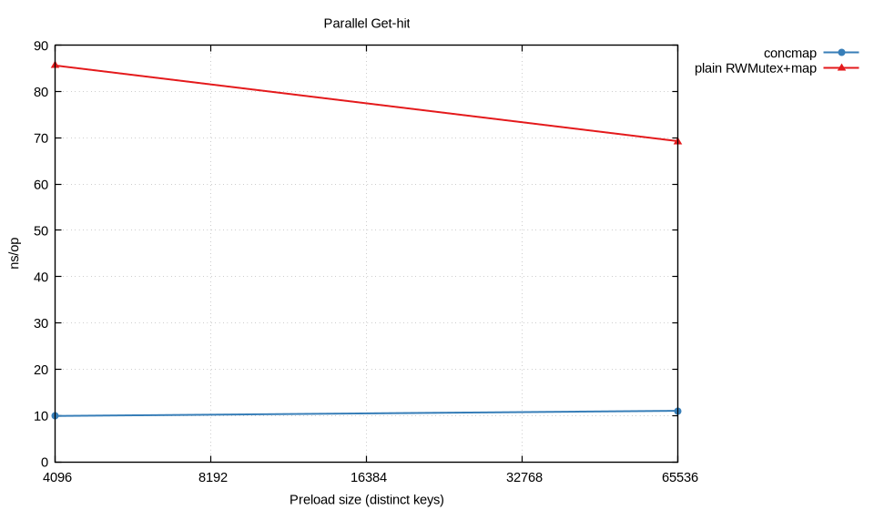
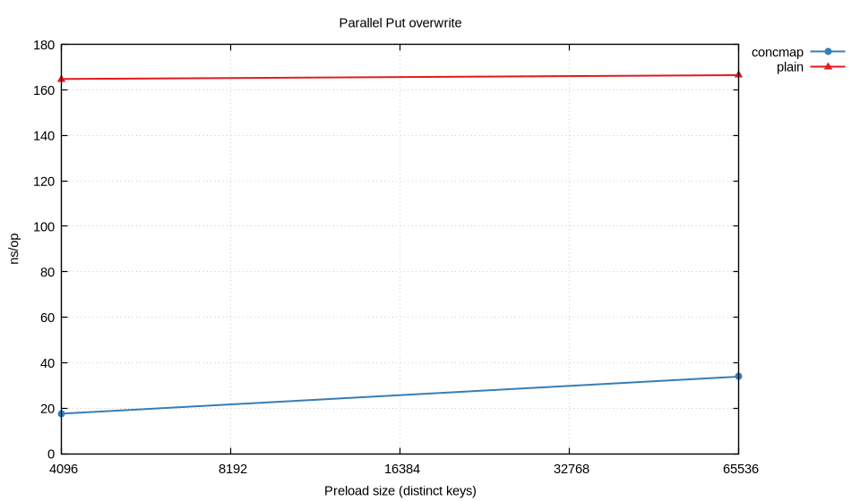
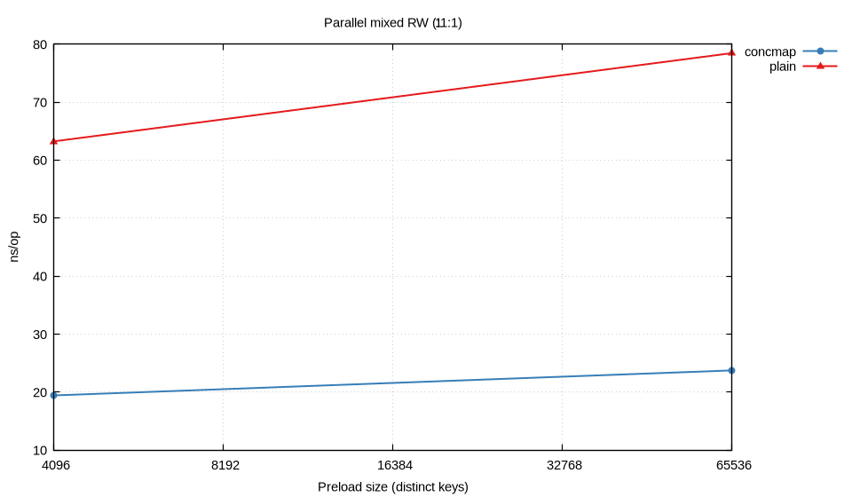
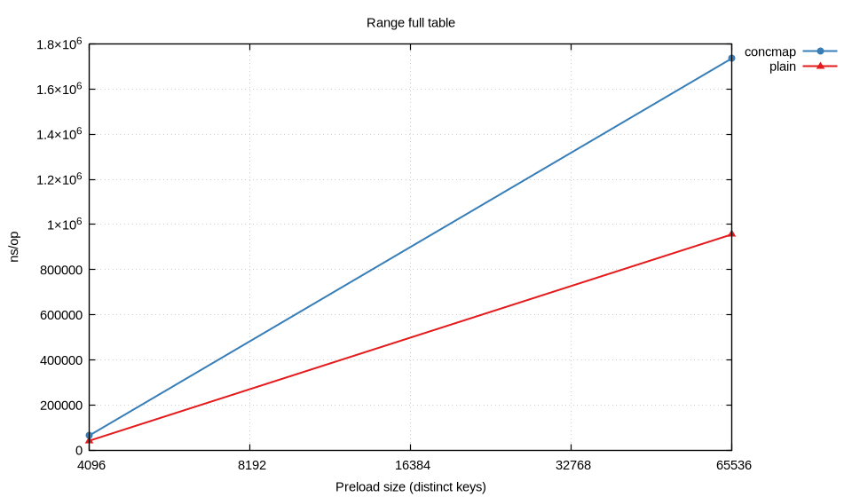
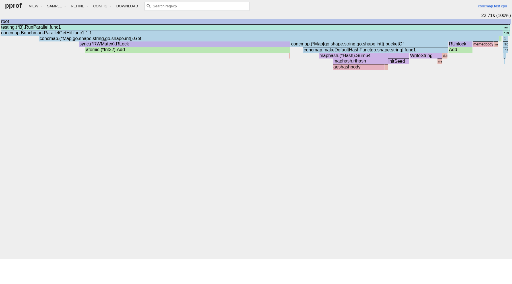
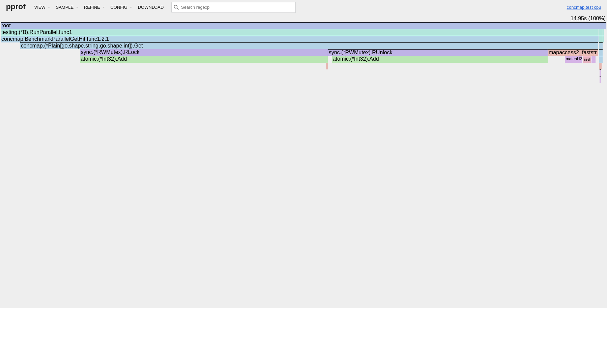
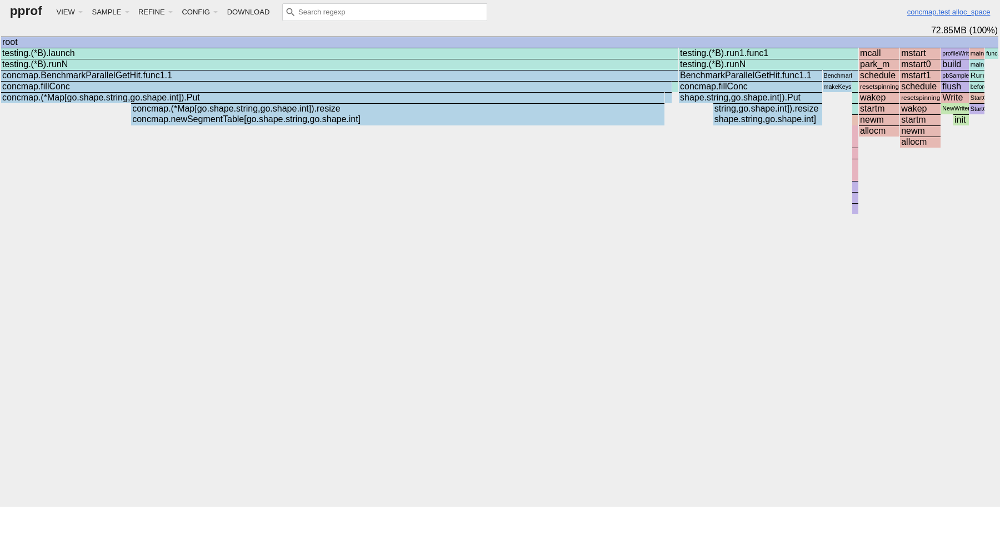
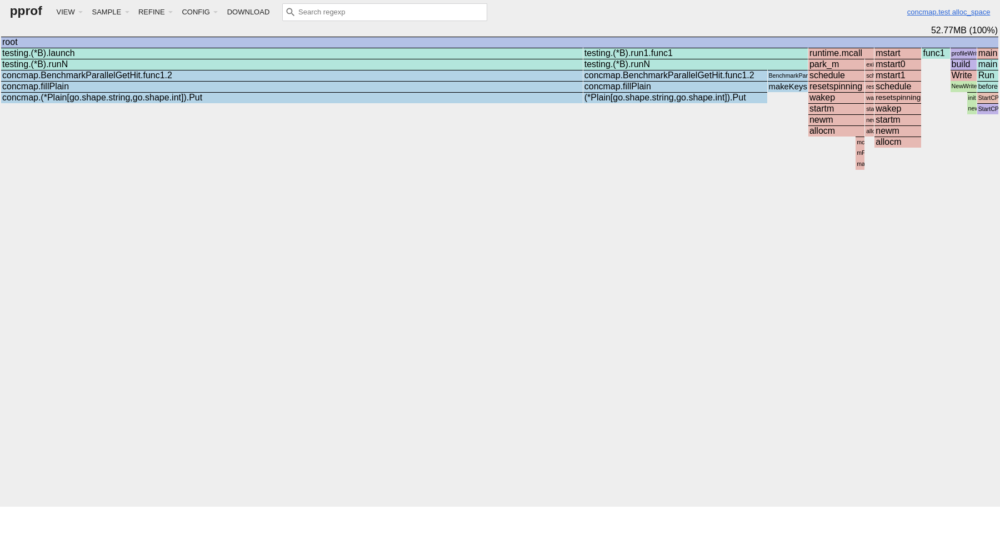

# Лабораторная работа №4 — Потокобезопасная хеш-таблица с закрытой адресацией

**Дисциплина:** Структуры и алгоритмы в базах данных и распределённых системах  
**Тема:** Сегментированная hash-map (striping) с per-bucket `RWMutex` и сравнение с baseline

---

## Содержание

1. [Теоретическая часть](#1-теоретическая-часть)
   - [1.1 Постановка и соответствие CHM](#11-постановка-и-соответствие-chm)
   - [1.2 Закрытая адресация](#12-закрытая-адресация)
   - [1.3 Baseline-реализации](#13-baseline-реализации)
2. [Практическая часть](#2-практическая-часть)
   - [2.1 API и файлы](#21-api-и-файлы)
   - [2.2 `Map` — основная структура](#22-map--основная-структура)
3. [Исследовательская часть](#3-исследовательская-часть)
   - [3.1 Аппаратные характеристики](#31-аппаратные-характеристики)
   - [3.2 Методика замеров](#32-методика-замеров)
   - [3.3 Параллельные сценарии](#33-параллельные-сценарии)
   - [3.4 Однопоточный Get (concmap / plain / unsafe)](#34-однопоточный-get-concmap--plain--unsafe)
4. [Concurrency-тесты](#4-concurrency-тесты)
5. [Профилирование](#5-профилирование)
6. [Вывод](#6-вывод)

---

## 1. Теоретическая часть

### 1.1 Постановка и соответствие CHM

Требуется **потокобезопасная** хеш-таблица с минимальным API:

| Операция | Семантика |
|:---------|:----------|
| `Put` | вставка или перезапись |
| `Get` | чтение по ключу |
| `Size` | число ключей |
| `Clear` | удалить все пары |
| `Merge` | как в JDK `ConcurrentHashMap.merge`: для нового ключа — `value` без `merger`; иначе `merger(existing, incoming)` |
| `Range` | итератор (callback) по парам ключ–значение |

Дополнительные требования (по [документации `ConcurrentHashMap`](https://docs.oracle.com/en/java/javase/21/docs/api/java.base/java/util/concurrent/ConcurrentHashMap.html)):

- операции чтения **`Get` / `Range`** «почти никогда не блокируют» — не ждут записи в **других** сегментах;
- между **завершёнными** операциями есть наблюдаемый порядок (**happens-before**): в Go это обеспечивается `sync.RWMutex` (release при `Unlock`/`RUnlock`, acquire при последующем `Lock`/`RLock`).

### 1.2 Закрытая адресация

**Закрытая адресация** — коллизии разрешаются **цепочками** внутри бакета (отдельные связные списки), а не пробированием в массиве слотов (открытая адресация).

Таблица состоит из `2^bucketBits` бакетов; индекс бакета: `hash(key) & (n-1)`.

### 1.3 Baseline-реализации

| Реализация | Назначение |
|:-----------|:-----------|
| **`Unsafe`** | встроенная `map` **без** синхронизации — эталон «не-thread-safe» для однопоточных тестов и бенчмарков |
| **`Plain`** | одна `sync.RWMutex` вокруг `map` — грубая потокобезопасность для **параллельных** сравнений |
| **`Map`** | сегментированная таблица: свой `RWMutex` на бакет |

---

## 2. Практическая часть

### 2.1 API и файлы

| Файл | Назначение |
|:-----|:-----------|
| [`internal/concmap/map.go`](internal/concmap/map.go) | `Map`, `New`, `Put`, `Get`, `Merge`, `Clear`, `Size`, `Range`, `WithHasher`, `WithLoadFactor`, rehash (resize) |
| [`internal/concmap/plain.go`](internal/concmap/plain.go) | `Plain` — глобальный `RWMutex` + `map` |
| [`internal/concmap/unsafe.go`](internal/concmap/unsafe.go) | `Unsafe` — `map` без mutex (только однопоточно) |
| [`internal/concmap/hasher.go`](internal/concmap/hasher.go) | reflect-хэш для общих `K` |

Воспроизведение:

```bash
make test          # модульные + оракул-тесты
make test-race     # -race -count=3
make collect plot  # бенчи → CSV → gnuplot PNG
make profile       # CPU/heap prof → flamegraph HTML/PNG
```

### 2.2 `Map` — основная структура

- бакет: `sync.RWMutex` + односвязный список `node`;
- активная таблица — `atomic.Pointer[segmentTable]` (бакеты + `mask`); при **resize** выделяется таблица в 2× больше, узлы перехешируются, указатель атомарно подменяется;
- **load factor** по умолчанию **0.75** (`WithLoadFactor`): после вставки нового ключа, если `size > 0.75 · len(buckets)` и `bucketBits < max`, вызывается `resize` под `resizeMu` (один rehash за раз; все старые бакеты блокируются слева направо, как в `Clear`);
- `Get` / `Range` — `RLock` **только своего** бакета (снимок таблицы на момент вызова);
- `Put` / `Merge` — `Lock` бакета; `Size` — `atomic.Uint64` (+1 только при вставке нового ключа);
- `Clear` — под `resizeMu` + последовательный захват всех бакетов слева направо (анти-deadlock), обнуление цепочек и `size.Store(0)`;
- `Range` — слабая согласованность (weakly-consistent view): без паник при конкурентных изменениях, без гарантии «снимка всей таблицы».

---

## 3. Исследовательская часть

### 3.1 Аппаратные характеристики

Замеры отчёта: Linux amd64 (Fedora), параметры CPU — строка `cpu:` в `metrics/raw/benchmarks.txt`; Go — версия из `go.mod`.

### 3.2 Методика замеров

- **`BENCH_KEYS`** — размеры предзаполненной таблицы (по умолчанию `4096,65536`);
- параллельные сценарии — `testing.B.RunParallel` (`GOMAXPROCS` потоков);
- однопоточный `Get` — отдельный бенч `BenchmarkSequentialGetHit` (сравнение накладных расходов синхронизации).

### 3.3 Параллельные сценарии

#### Таблица 3.1 — `ns/op` (`BENCH_KEYS=4096,65536`, `metrics/raw/benchmarks.csv`)

| workload | impl | keys | ns/op |
|:---------|:-----|-----:|------:|
| ParallelGetHit | concmap | 4096 | 9.91 |
| ParallelGetHit | plain | 4096 | 85.61 |
| ParallelGetHit | concmap | 65536 | 11.02 |
| ParallelGetHit | plain | 65536 | 69.26 |
| ParallelPutOverwrite | concmap | 4096 | 17.60 |
| ParallelPutOverwrite | plain | 4096 | 164.8 |
| ParallelPutOverwrite | concmap | 65536 | 33.90 |
| ParallelPutOverwrite | plain | 65536 | 166.5 |
| ParallelMixedRW | concmap | 4096 | 19.42 |
| ParallelMixedRW | plain | 4096 | 63.23 |
| ParallelMixedRW | concmap | 65536 | 23.73 |
| ParallelMixedRW | plain | 65536 | 78.45 |
| RangeFullTable | concmap | 4096 | 65071 |
| RangeFullTable | plain | 4096 | 41607 |
| RangeFullTable | concmap | 65536 | 1737434 |
| RangeFullTable | plain | 65536 | 956588 |

#### Рисунок 3.1 — Parallel Get-hit



#### Рисунок 3.2 — Parallel Put overwrite



#### Рисунок 3.3 — Parallel mixed RW



#### Рисунок 3.4 — Range full table



**Анализ.**

- **Parallel Get-hit:** `concmap` в **3–4×** быстрее `Plain` — чтения не делят один глобальный `RLock` с записями в другие бакеты.
- **Put overwrite:** выигрыш **~10×** — `Plain` сериализует все мутации для всех читателей.
- **Mixed RW:** преимущество сохраняется, но меньше из-за локальных `Merge`/`Put`.
- **Range:** умеренный выигрыш — короткие `RLock` на бакет вместо одного захвата всей `map`; абсолютная стоимость велика (обход всех цепочек).

### 3.4 Однопоточный Get (concmap / plain / unsafe)

Для сравнения с **не-thread-safe** `map` добавлен `BenchmarkSequentialGetHit` (одна горутина, без `RunParallel`):

| impl | роль |
|:-----|:-----|
| `unsafe` | нижняя граница — встроенная `map` |
| `concmap` | цепочки + `RLock` на бакет |
| `plain` | `map` + `RLock` на всю таблицу |

Пример (`BENCH_KEYS=4096`, одна горутина в теле бенча):

| impl | ns/op |
|:-----|------:|
| unsafe | 13.5 |
| plain | 20.6 |
| concmap | 37.2 |

**Анализ:** в **однопотоке** `unsafe` быстрее всех; `plain` обгоняет `concmap`, потому что встроенная `map` O(1) против обхода цепочки. Выигрыш `concmap` проявляется в **§3.3** при `RunParallel`, когда `Plain` блокирует всех читателей на любой записи. Полный прогон: `make collect`.

---

## 4. Concurrency-тесты

В Java для этого используют **jcstress**; в Go применены:

1. **`go test -race`** (`make test-race`, `-count=3`) — детектор гонок по happens-before.
2. **`TestMapMatchesUnsafeOracle`** — последовательная сверка `Map` с `Unsafe` на случайных `Put`/`Get`/`Merge`/`Clear` (паттерн оракула как `TestSearcherRandomInsertAndQuery` в lab-2).
3. **`TestMapImplsMatchUnsafeOracle`** — то же для `concmap` и `plain` в однопоточном режиме.
4. **`TestStressMergeAdditiveRace`** — параллельное суммирование через `Merge` vs эталон под `mutex`.
5. **`TestStressPlainVsConcNoPanicRace`** — хаотичный микс `Put`/`Get`/`Merge`/`Range`/`Clear` из 32 горутин.
6. **`TestHappensBeforePutGet`**, **`TestSizeZeroAfterClearConcurrent`**.
7. **`TestResizePreservesKeys`**, **`TestResizeMatchesUnsafeOracle`** — корректность rehash при частых удвоениях таблицы.

---

## 5. Профилирование

Профили сняты для `BenchmarkParallelGetHit/size_65536/{concmap|plain}` (`-cpuprofile` / `-memprofile`).  
Flamegraph-ы — через `go tool pprof -http` и [`scripts/gen_flamegraphs.sh`](scripts/gen_flamegraphs.sh) (как в lab-2). Текстовые `top` — в `metrics/profiles/`.

### 5.1 CPU — параллельный Get

**Рисунок 5.1 — Flamegraph CPU, `concmap`**



**Рисунок 5.2 — Flamegraph CPU, `plain`**



| Функция | flat (порядок) | Вывод |
|:--------|:---------------|:------|
| `concmap`: `memeqbody` | ~31% | сравнение строковых ключей в цепочке |
| `concmap`: `Map.Get` cum | ~96% | hot-path: `RLock` + обход списка |
| `plain`: `atomic` в `RWMutex` | ~76% | contention на глобальном замке |
| `plain`: `Plain.Get` cum | ~96% | builtin `map` под одним `RLock` |

Интерактивно: [`flamegraph_cpu_parallel_get_conc.html`](metrics/plots/flamegraph_cpu_parallel_get_conc.html), [`flamegraph_cpu_parallel_get_plain.html`](metrics/plots/flamegraph_cpu_parallel_get_plain.html).

### 5.2 Память — параллельный Get (`alloc_space`)

**Рисунок 5.3 — Flamegraph памяти, `concmap`**



**Рисунок 5.4 — Flamegraph памяти, `plain`**



| Функция | concmap | plain | Вывод |
|:--------|--------:|------:|:------|
| `Put` (прогрев) | ~43% alloc | ~71% alloc | у `Plain` дороже рост builtin-`map` |
| `makeKeys` / runtime | заметная доля | заметная доля | шум параллельного бенча; для «чистого» Get — разнести прогрев и профиль |

HTML: [`flamegraph_mem_parallel_get_conc.html`](metrics/plots/flamegraph_mem_parallel_get_conc.html), [`flamegraph_mem_parallel_get_plain.html`](metrics/plots/flamegraph_mem_parallel_get_plain.html).

---

## 6. Вывод

1. Реализована сегментированная hash-map с **закрытой адресацией** и API по ТЗ; чтения локализуют блокировки на бакет.
2. Добавлен **rehash (resize)** при load factor 0.75: удвоение числа бакетов, перенос цепочек, атомарная подмена таблицы.
3. Три уровня сравнения: **`Unsafe`** (не-thread-safe), **`Plain`** (глобальный mutex), **`Map`** (per-bucket) — покрывают и требование ТЗ, и параллельные бенчи.
4. На параллельных нагрузках `Map` в **~4–10×** быстрее `Plain`; узкое место — обход цепочек, хеш и `RLock` (видно на flamegraph; `resize` на Get-бенче — доли процента CPU при прогреве).
5. Корректность: **`-race`**, оракул-тесты против `Unsafe`, стресс `Merge`, тесты resize.
6. Ограничения: resize блокирует все старые бакеты (упрощение относительно JDK CHM), `Size` при гонках с `Clear` — как у CHM, без строгого снимка.

| Сценарий | Рекомендация |
|:---------|:-------------|
| Однопоток, максимум скорости | `Unsafe` / builtin `map` |
| Много читателей, редкие записи в разные ключи | `Map` (concmap) |
| Простая обёртка над `map` | `Plain` (проще, но хуже под contention) |
