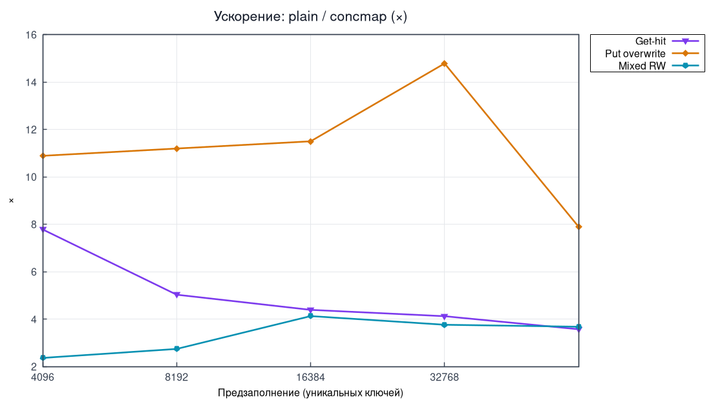
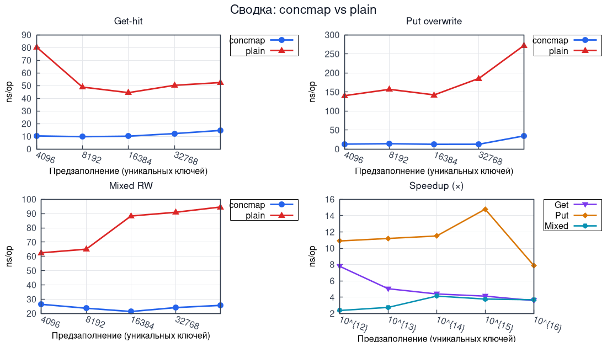
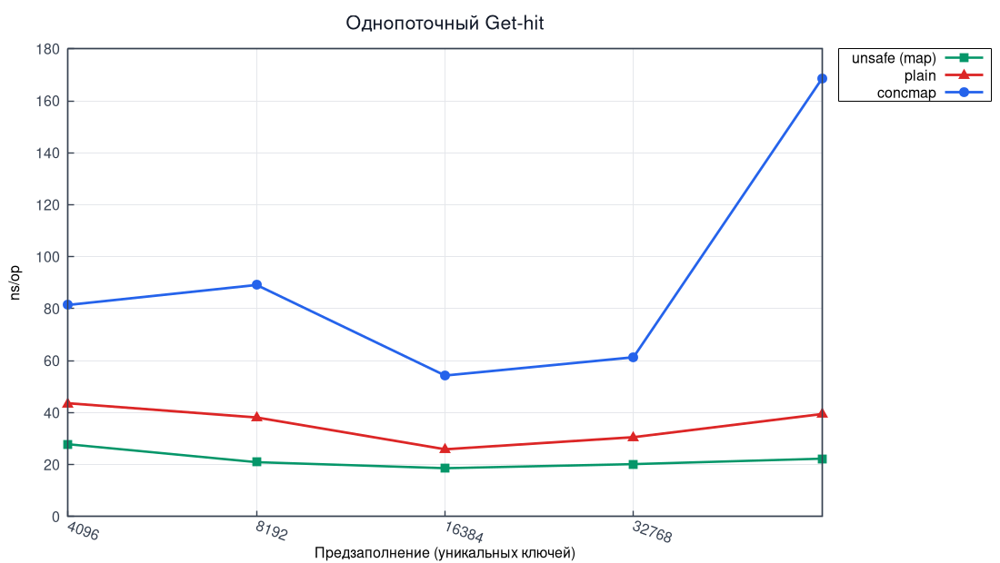

# Лабораторная работа №4 — Потокобезопасная хеш-таблица с закрытой адресацией

**Дисциплина:** Структуры и алгоритмы в базах данных и распределённых системах  
**Тема:** Сегментированная hash-map (striping) с per-bucket `RWMutex` и сравнение с baseline

---

## Содержание

1. [Теоретическая часть](#1-теоретическая-часть)
   - [1.1 Постановка и соответствие CHM](#11-постановка-и-соответствие-chm)
   - [1.2 Закрытая адресация](#12-закрытая-адресация)
   - [1.3 Baseline-реализации](#13-baseline-реализации)
2. [Практическая часть](#2-практическая-часть)
   - [2.1 API и файлы](#21-api-и-файлы)
   - [2.2 `Map` — основная структура](#22-map--основная-структура)
3. [Исследовательская часть](#3-исследовательская-часть)
   - [3.1 Аппаратные характеристики](#31-аппаратные-характеристики)
   - [3.2 Методика замеров](#32-методика-замеров)
   - [3.3 Параллельные сценарии](#33-параллельные-сценарии)
   - [3.4 Однопоточный Get (concmap / plain / unsafe)](#34-однопоточный-get-concmap--plain--unsafe)
4. [Concurrency-тесты](#4-concurrency-тесты)
5. [Профилирование](#5-профилирование)
6. [Вывод](#6-вывод)

---

## 1. Теоретическая часть

### 1.1 Постановка и соответствие CHM

Требуется **потокобезопасная** хеш-таблица с минимальным API:

| Операция | Семантика |
|:---------|:----------|
| `Put` | вставка или перезапись |
| `Get` | чтение по ключу |
| `Size` | число ключей |
| `Clear` | удалить все пары |
| `Merge` | как в JDK `ConcurrentHashMap.merge`: для нового ключа — `value` без `merger`; иначе `merger(existing, incoming)` |
| `Range` | итератор (callback) по парам ключ–значение |

Дополнительные требования (по [документации `ConcurrentHashMap`](https://docs.oracle.com/en/java/javase/21/docs/api/java.base/java/util/concurrent/ConcurrentHashMap.html)):

- операции чтения **`Get` / `Range`** «почти никогда не блокируют» — не ждут записи в **других** сегментах;
- между **завершёнными** операциями есть наблюдаемый порядок (**happens-before**): в Go это обеспечивается `sync.RWMutex` (release при `Unlock`/`RUnlock`, acquire при последующем `Lock`/`RLock`).

### 1.2 Закрытая адресация

**Закрытая адресация** — коллизии разрешаются **цепочками** внутри бакета (отдельные связные списки), а не пробированием в массиве слотов (открытая адресация).

Таблица состоит из `2^bucketBits` бакетов; индекс бакета: `hash(key) & (n-1)`.

### 1.3 Baseline-реализации

| Реализация | Назначение |
|:-----------|:-----------|
| **`Unsafe`** | встроенная `map` **без** синхронизации — эталон «не-thread-safe» для однопоточных тестов и бенчмарков |
| **`Plain`** | одна `sync.RWMutex` вокруг `map` — грубая потокобезопасность для **параллельных** сравнений |
| **`Map`** | сегментированная таблица: свой `RWMutex` на бакет |

---

## 2. Практическая часть

### 2.1 API и файлы

| Файл | Назначение |
|:-----|:-----------|
| [`internal/concmap/map.go`](internal/concmap/map.go) | `Map`, `New`, `Put`, `Get`, `Merge`, `Clear`, `Size`, `Range`, `WithHasher`, `WithLoadFactor`, rehash (resize) |
| [`internal/concmap/plain.go`](internal/concmap/plain.go) | `Plain` — глобальный `RWMutex` + `map` |
| [`internal/concmap/unsafe.go`](internal/concmap/unsafe.go) | `Unsafe` — `map` без mutex (только однопоточно) |
| [`internal/concmap/hasher.go`](internal/concmap/hasher.go) | reflect-хэш для общих `K` |

Воспроизведение:

```bash
make test          # модульные + оракул-тесты
make test-race     # -race -count=3
make collect plot  # бенчи → CSV → gnuplot PNG
make profile       # CPU/heap prof → flamegraph HTML/PNG
```

### 2.2 `Map` — основная структура

- бакет: `sync.RWMutex` + односвязный список `node`;
- активная таблица — `atomic.Pointer[segmentTable]` (бакеты, `mask`, `bits`); при **resize** выделяется таблица в 2× больше, узлы перехешируются, указатель атомарно подменяется;
- **load factor** по умолчанию **0.75** (`WithLoadFactor`): после вставки нового ключа, если `size > 0.75 · len(buckets)` и `t.bits < maxBucketBits`, вызывается `resize` под `resizeMu` (один rehash за раз; все старые бакеты блокируются слева направо, как в `Clear`);
- **`Put` / `Get` / `Merge`:** после захвата замка бакета проверяется `m.table() == t`; при смене таблицы во время rehash — отпускание замка и повтор (корректность при concurrent resize);
- `Get` / `Range` — `RLock` **только своего** бакета текущей таблицы;
- `Put` / `Merge` — `Lock` бакета; `Size` — `atomic.Uint64` (+1 только при вставке нового ключа);
- `Clear` — под `resizeMu` + захват всех бакетов текущей таблицы (с повтором, если таблица сменилась), обнуление цепочек и `size.Store(0)`;
- `Range` — слабая согласованность (weakly-consistent view): при rehash обход перезапускается; без гарантии «снимка всей таблицы».

---

## 3. Исследовательская часть

### 3.1 Аппаратные характеристики

Замеры отчёта (пересчитаны `make metrics`, `make profile`, 2026-05-30): Linux amd64, `goos: linux`, `goarch: amd64`, CPU — `AMD Eng Sample: 100-000000829-50_Y` (строка `cpu:` в [`metrics/raw/benchmarks.txt`](metrics/raw/benchmarks.txt)); Go **1.22** (`go.mod`), `GOMAXPROCS=16` в бенчах.

### 3.2 Методика замеров

- **`BENCH_KEYS`** — `4096,8192,16384,32768,65536` (степени двойки, **5 точек** на кривой);
- **`benchtime=600ms`**, `BENCH_BUCKET_BITS=12` (по умолчанию в бенчах);
- параллельные сценарии — `testing.B.RunParallel` (`GOMAXPROCS` потоков);
- графики: `make metrics` → CSV/TSV + gnuplot (`plot_metrics.gnuplot`); на оси X — **только измеренные** размеры (`xtic` из данных), без ложной интерполяции;
- дополнительно: **speedup** `plain/concmap`, **столбцы @ 64k**, **дашборд 2×2**, однопоточный Get.

### 3.3 Параллельные сценарии

Полный прогон — [`metrics/raw/benchmarks.csv`](metrics/raw/benchmarks.csv) (40 строк). Ниже — крайние размеры; кривые по всем пяти точкам — на рис. 3.1–3.4.

#### Таблица 3.1 — `ns/op` (фрагмент, `benchtime=600ms`)

| workload | impl | keys | ns/op |
|:---------|:-----|-----:|------:|
| ParallelGetHit | concmap | 4096 | 12.12 |
| ParallelGetHit | plain | 4096 | 83.30 |
| ParallelGetHit | concmap | 65536 | 14.65 |
| ParallelGetHit | plain | 65536 | 48.85 |
| ParallelPutOverwrite | concmap | 4096 | 14.93 |
| ParallelPutOverwrite | plain | 4096 | 148.1 |
| ParallelPutOverwrite | concmap | 65536 | 31.52 |
| ParallelPutOverwrite | plain | 65536 | 184.2 |
| ParallelMixedRW | concmap | 4096 | 23.86 |
| ParallelMixedRW | plain | 4096 | 77.12 |
| ParallelMixedRW | concmap | 65536 | 23.01 |
| ParallelMixedRW | plain | 65536 | 95.88 |
| RangeFullTable | concmap | 4096 | 72794 |
| RangeFullTable | plain | 4096 | 45225 |
| RangeFullTable | concmap | 65536 | 1.875×10⁶ |
| RangeFullTable | plain | 65536 | 9.541×10⁵ |

#### Рисунок 3.1 — Parallel Get-hit (5 точек)


#### Рисунок 3.2 — Parallel Put overwrite


#### Рисунок 3.3 — Parallel mixed RW


#### Рисунок 3.4 — Range (log Y)


#### Рисунок 3.5 — Ускорение plain / concmap



#### Рисунок 3.6 — Дашборд (2×2, для слайда)



**Анализ** (по всему диапазону ключей и табл. 3.1).

- **Parallel Get-hit:** `concmap` стабильно **~12–15 ns/op**; `plain` **~48–83 ns/op** → ускорение **~3,5–7×** (рис. 3.5). На 16k у `plain` локальный минимум (~49 ns) — меньше contention при длинных цепочках в concmap.
- **Put overwrite:** **~6–10×** на 64k, до **~10×** на 4k — глобальный замок `Plain` сериализует записи и блокирует читателей.
- **Mixed RW:** **~3–4×** по всему диапазону.
- **Range:** `concmap` **медленнее** `Plain` (**~1,6–2×**, рис. 3.4 с log Y): много `RLock` по бакетам + обход цепочек vs один `RLock` на builtin-`map`.

### 3.4 Однопоточный Get (concmap / plain / unsafe)

Для сравнения с **не-thread-safe** `map` добавлен `BenchmarkSequentialGetHit` (одна горутина, без `RunParallel`):

| impl | роль |
|:-----|:-----|
| `unsafe` | нижняя граница — встроенная `map` |
| `concmap` | цепочки + `RLock` на бакет |
| `plain` | `map` + `RLock` на всю таблицу |

Таблица 3.2 — `BenchmarkSequentialGetHit`, `ns/op` (тот же прогон; кривая — рис. 3.8):

| impl | keys=4096 | keys=65536 |
|:-----|----------:|-----------:|
| unsafe | 28.21 | 22.99 |
| plain | 44.99 | 36.59 |
| concmap | 77.81 | 161.8 |

#### Рисунок 3.8 — Однопоточный Get-hit



**Анализ:** в **однопотоке** `unsafe` быстрее всех; `plain` обгоняет `concmap`, потому что встроенная `map` O(1) против обхода цепочки (на 65k ключей у concmap длиннее цепочки — рост до ~162 ns/op). Выигрыш `concmap` — в **§3.3** при `RunParallel`. Пересчёт: `make metrics`.

---

## 4. Concurrency-тесты

В Java для этого используют **jcstress**; в Go применены:

1. **`go test -race`** (`make test-race`, `-count=3`) — детектор гонок по happens-before.
2. **`TestMapMatchesUnsafeOracle`** — последовательная сверка `Map` с `Unsafe` на случайных `Put`/`Get`/`Merge`/`Clear` (паттерн оракула как `TestSearcherRandomInsertAndQuery` в lab-2).
3. **`TestMapImplsMatchUnsafeOracle`** — то же для `concmap` и `plain` в однопоточном режиме.
4. **`TestStressMergeAdditiveRace`** — параллельное суммирование через `Merge` vs эталон под `mutex`.
5. **`TestStressPlainVsConcNoPanicRace`** — хаотичный микс `Put`/`Get`/`Merge`/`Range`/`Clear` из 32 горутин.
6. **`TestHappensBeforePutGet`**, **`TestSizeZeroAfterClearConcurrent`**.
7. **`TestResizePreservesKeys`**, **`TestResizeMatchesUnsafeOracle`** — корректность rehash в однопотоке.
8. **`TestConcurrentResizePutGet`** — 32 горутины, `bucketBits=2` (частый rehash), сверка `Put`/`Get`/`Size` с эталоном под `mutex`; проходит с `-race`.

---

## 5. Профилирование

Профили сняты для `BenchmarkParallelGetHit/size_65536/{concmap|plain}` (`-cpuprofile` / `-memprofile`).  
Flamegraph-ы — через `go tool pprof -http` и [`scripts/gen_flamegraphs.sh`](scripts/gen_flamegraphs.sh) (как в lab-2). Текстовые `top` — в `metrics/profiles/`.

### 5.1 CPU — параллельный Get

**Рисунок 5.1 — Flamegraph CPU, `concmap`**


**Рисунок 5.2 — Flamegraph CPU, `plain`**


| Функция | flat / cum (прогон 2026-05-30) | Вывод |
|:--------|:--------------------------------|:------|
| `concmap`: `sync/atomic` в `RWMutex` | ~46% flat | contention на per-bucket `RLock` |
| `concmap`: `Map.Get` | ~92% cum | hot-path: хеш + `RLock` + обход цепочки |
| `concmap`: `memeqbody` | ~4% flat | сравнение строковых ключей |
| `plain`: `sync/atomic` в `RWMutex` | ~78% flat | contention на **глобальном** замке |
| `plain`: `Plain.Get` | ~95% cum | builtin `map` под одним `RLock` |

Интерактивно: [`flamegraph_cpu_parallel_get_conc.html`](metrics/plots/flamegraph_cpu_parallel_get_conc.html), [`flamegraph_cpu_parallel_get_plain.html`](metrics/plots/flamegraph_cpu_parallel_get_plain.html).

### 5.2 Память — параллельный Get (`alloc_space`)

**Рисунок 5.3 — Flamegraph памяти, `concmap`**


**Рисунок 5.4 — Flamegraph памяти, `plain`**


| Функция | concmap | plain | Вывод |
|:--------|--------:|------:|:------|
| `newSegmentTable` / `Put` (прогрев) | ~67% / ~79% cum | — | у `concmap` аллокации при заполнении сегментов |
| `Plain.Put` (прогрев) | — | ~72% alloc | у `Plain` дороже рост builtin-`map` |
| pprof / runtime | мелкая доля | мелкая доля | шум профилирования; для «чистого» Get — разнести прогрев и профиль |

HTML: [`flamegraph_mem_parallel_get_conc.html`](metrics/plots/flamegraph_mem_parallel_get_conc.html), [`flamegraph_mem_parallel_get_plain.html`](metrics/plots/flamegraph_mem_parallel_get_plain.html).

---

## 6. Вывод

1. Реализована сегментированная hash-map с **закрытой адресацией** и API по ТЗ; чтения локализуют блокировки на бакет.
2. **Rehash (resize)** при load factor 0.75: удвоение бакетов, перенос цепочек, атомарная подмена таблицы; **retry** при `m.table() != t` после захвата замка — корректность при concurrent rehash.
3. Три уровня сравнения: **`Unsafe`**, **`Plain`**, **`Map`** — покрывают ТЗ и параллельные бенчи (табл. 3.1–3.2, графики в `metrics/plots/`).
4. На параллельных нагрузках `Map` **~3,5–10×** быстрее `Plain` (кривые и speedup, рис. 3.1–3.7); на **`Range`** — медленнее из-за множества `RLock` и цепочек.
5. Корректность: **`-race`**, оракул-тесты, стресс `Merge`, **`TestConcurrentResizePutGet`**.
6. Ограничения: resize блокирует все старые бакеты; старые таблицы не освобождаются; `Size` при гонках с `Clear` — без строгого снимка (как у CHM).

| Сценарий | Рекомендация |
|:---------|:-------------|
| Однопоток, максимум скорости | `Unsafe` / builtin `map` |
| Много читателей, редкие записи в разные ключи | `Map` (concmap) |
| Простая обёртка над `map` | `Plain` (проще, но хуже под contention) |
