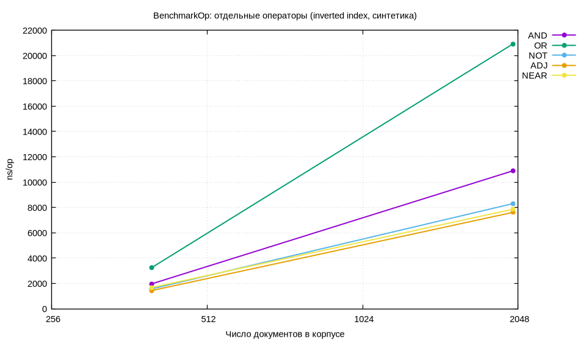
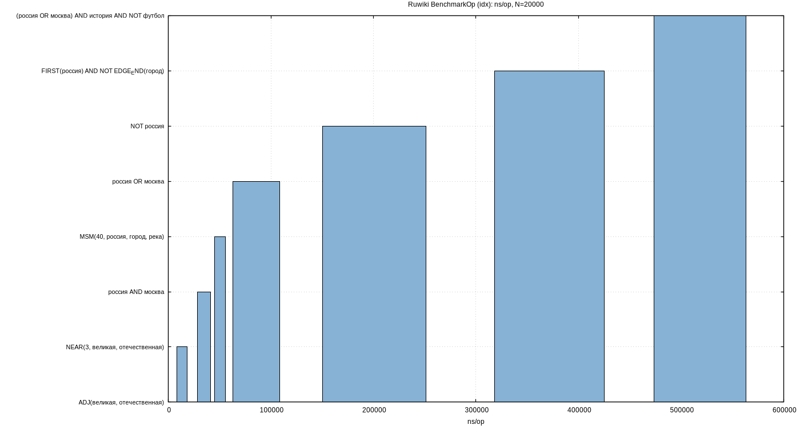
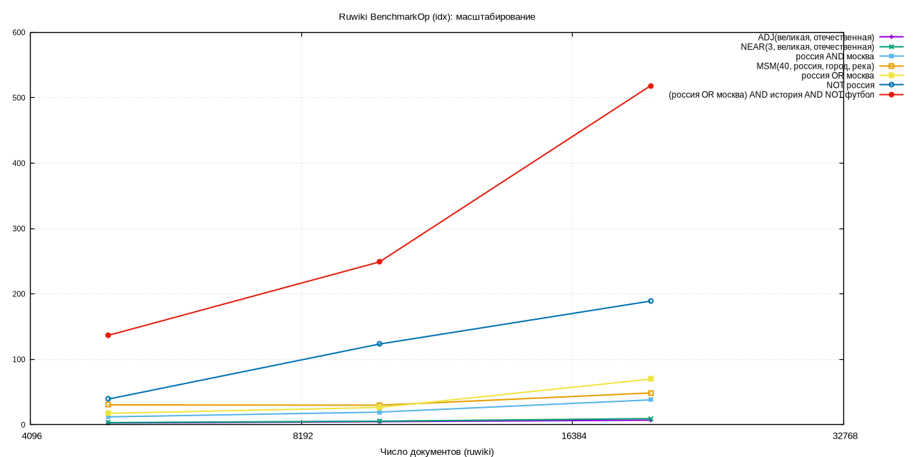

# Лабораторная работа №5 — Обратный индекс, булевы запросы, mmap, сжатие, TF/IDF(BM25)

**Дисциплина:** Структуры и алгоритмы в базах данных и распределённых системах  
**Тема:** … сжатие (**PForDelta + optimal varint|bitpack**, `IRIXV3PD`); … **`irquery`** …

---

## Содержание

1. [Постановка](#1-постановка)
2. [Реализация и язык запросов](#2-реализация-и-язык-запросов)
3. [Методика бенчмарков](#3-методика-бенчмарков)
4. [Результаты и графики](#4-результаты-и-графики)
5. [Тесты и эталон SlowEval](#5-тесты-и-эталон-sloweval)
6. [Профилирование CPU и памяти](#6-профилирование-cpu-и-памяти)
7. [Вывод](#7-вывод)

---

## 1. Постановка

### Соответствие ТЗ (чеклист)

- **1) Координатный индекс + булевы операции + ADJ/NEAR**: [`index.go`](internal/ir/index.go), [`eval.go`](internal/ir/eval.go), [`ast.go`](internal/ir/ast.go). `AND` — `intersectSortedSkip` ([`eval.go`](internal/ir/eval.go)).
- **2) Сложные запросы**: [`parse.go`](internal/ir/parse.go) (`NOT > AND > OR`, `NEAR`/`ADJ`/`FIRST`/`LAST`).
- **3) Дисковый индекс + mmap**: [`storage.go`](internal/ir/storage.go) `SaveCompressed`, `OpenMMapIndex`.
- **4) Сжатие**: **IRIXV3PD** — doc Δ **PForDelta**; tf/pos Δ — **varint|bitpack (optimal, V4)**; табл. 4.1в.
- **5) BM25**: [`bm25.go`](internal/ir/bm25.go), `SearchBM25MMap`, `irquery -rank`.
- **6) Бенчмарки**: `BenchmarkOp` на **ruwiki** (`make bench-wiki`), графики §4.6.
- **7) Стенд запросов**: [`cmd/irquery`](cmd/irquery/main.go) — docID + **заголовок wiki** + terms×tf.

| Требование | Где в коде | Как проверено |
|:-----------|:-----------|:--------------|
| Буфер позиций при сборке | `posArena`, `scratchKeys` — [`index.go`](internal/ir/index.go) | табл. 4.2, §6.4 |
| Сборка вики без копии текстов | `AddLean` — [`index.go`](internal/ir/index.go) | табл. 4.1б, `irindex` |
| Буферы на запросах | `EvalCtx`, `PostingIndex` — [`eval_ctx.go`](internal/ir/eval_ctx.go) | табл. 4.3–4.4, §6.2 |
| BM25 на mmap | `SearchBM25MMap`, `BM25Index` — [`bm25.go`](internal/ir/bm25.go) | `TestBM25MMap`, `irquery -rank` |
| Кириллица в запросах | UTF-8 лексер — [`parse.go`](internal/ir/parse.go) | `TestParseCyrillicTerms`, `irquery` на ruwiki |
| Интервалы `BENCH_CORPUS` | `400,2000` синтетика | табл. 3.1, 4.4–4.5 |
| Операторы по отдельности | `BenchmarkOp` | табл. 4.5 |
| Размер до/после сжатия | `MeasureIndexSizes`, `irindex` | **табл. 4.1а–4.1б, 4.1в** |
| Varint → PForDelta+opt | `IRIXV1` → `IRIXV3PD` (V4) | табл. 4.1в, `TestPostingsP4Roundtrip` |
| Проверяемый вывод irquery | `display.go`, titles в `.irx` | `история AND NOT(россии AND китая)` |
| Построение на корпусе | `irindex -maxdocs 20000` | **табл. 4.1б** |

---

## 2. Реализация и язык запросов

### Структура кода

| Файл | Назначение |
|:-----|:-----------|
| [`internal/ir/index.go`](internal/ir/index.go) | `InvIndex`, `Add` / `AddLean`, `posArena`, `scratchKeys` |
| [`internal/ir/bitpack.go`](internal/ir/bitpack.go) | упаковка потоков uint32 |
| [`internal/ir/storage.go`](internal/ir/storage.go) | `SaveCompressed`, `OpenMMapIndex`, формат `IRIXV3PD` |
| [`internal/ir/corpus.go`](internal/ir/corpus.go) | `BuildIndexFromWikiXML`, UTF-8 `Tokenize` |
| [`internal/ir/tokenize.go`](internal/ir/tokenize.go) | токены (латиница + кириллица) |
| [`internal/ir/eval.go`](internal/ir/eval.go), [`eval_ctx.go`](internal/ir/eval_ctx.go) | оценка, `EvalIndex` / mmap |
| [`internal/ir/search_mmap.go`](internal/ir/search_mmap.go) | `SearchBoolMMap` |
| [`cmd/irindex`](cmd/irindex/main.go) | построение `.irx` из XML |
| [`cmd/irquery`](cmd/irquery/main.go) | консольный стенд запросов |

### Консольный стенд (`irquery`)

```bash
go build -o bin/irquery ./cmd/irquery
./bin/irquery -index data/index.irx -q 'история AND NOT(россии AND китая)' -limit 10
```

Пример вывода:
```
hits=6854  time=...
  [1] doc=1  «Литва»
       terms: история×15  (total tf=15)
```

Запросы: `NOT(...)`, скобки, кириллица. **Пересоберите индекс** после обновления формата: `go run ./cmd/irindex …`.

---

## 3. Методика бенчмарков

```bash
make test
make collect plot          # синтетика BENCH_CORPUS=400,2000
make profile

# индекс и размеры на ruwiki:
go run ./cmd/irindex -xml ../ruwiki-latest-pages-articles.xml -maxdocs 20000 -out data/index.irx

# бенчмарки на ruwiki (запросы с кириллицей):
make bench-wiki parse-wiki plot WIKI_XML=../ruwiki-latest-pages-articles.xml \
  BENCH_CORPUS=5000,10000,20000 BENCH_TIME=300ms

# сравнение кодеков (размер полного `.irx`, КБ):
make collect-compression WIKI_XML=../ruwiki-latest-pages-articles.xml
```

### 3.1 Корпуса

| Назначение | Корпус | N |
|:-----------|:-------|--:|
| `go test -bench`, табл. 4.3–4.5 | синтетика `fillCorpus`, ~96 символов/док, 16 термов | **400, 2000** |
| размер индекса, построение, `irquery` | **ruwiki** `ruwiki-latest-pages-articles.xml` | **20 000** статей |

`BENCH_CORPUS=400,2000` — одни и те же N во всех бенчах `BenchmarkBuildIndex|Query|Op`.

| Сценарий | Бенч / команда |
|:---------|:---------------|
| Build (синт.) | `BenchmarkBuildIndex/corpN` |
| Смешанный запрос | `BenchmarkQueryEvalMixed/idx_N`, `scan_N` |
| ADJ / NEAR | `BenchmarkQueryAdjNear/idx_adj_N`, `idx_near_N` |
| Каждый оператор | `BenchmarkOp/<OP>/idx/corpN` |

---

## 4. Результаты и графики

### 4.1а Синтетика — RAM vs `.irx` (текущий V3)

[`TestIndexSizesOnSynthetic`](internal/ir/ir_test.go), `fillCorpus`, **`SaveCompressed` (V3)**. **1 КБ = 1024 B.**

| N | термов | RAM, КБ | `.irx` V3, КБ | RAM/файл |
|--:|-------:|--------:|--------------:|---------:|
| 400 | 16 | **425** | **10** | **42×** |
| 2000 | 16 | **2 132** | **50** | **43×** |

На синтетике в RAM лежат тексты документов (`Add`); коэффициент завышен относительно «lean»-сборки.

### 4.1в Сравнение кодеков — **сумма posting-блоков, КБ**

Сравнивается только сжатие **posting lists** (сумма `encode(postings[term])` по всем термам), **без** словаря, docLen и заголовков wiki — чтобы кодеки сравнивались на одном и том же материале.  
Источник: **`make collect-compression`** → [`metrics/raw/compression_sizes.tsv`](metrics/raw/compression_sizes.tsv).

**Синтетика** (`fillCorpus`):

| N | V1 varint | V2 bitpack | V3 P4+bitpack | **V4 P4+opt** |
|--:|----------:|-----------:|--------------:|--------------:|
| 400 | 15 | 7 | 7 | **7** |
| 2000 | 76 | 38 | 37 | **37** |

**Ruwiki** (`BuildIndexFromWikiXML`, **N = 20 000**):

| V1 varint | V2 bitpack | V3 P4+bitpack | **V4 P4+opt (боевой)** |
|----------:|-----------:|--------------:|-----------------------:|
| **120 522** | 161 326 | 173 422 | **153 645** |

- **V3** — PForDelta + bitpack tf/pos (для сравнения «чистого» P4+BP).  
- **V4** — PForDelta + **varint|bitpack** tf/pos (что компактнее); **формат `SaveCompressed` / `.irx`**.  
- **V1** — varint по всем потокам (baseline).

На ruwiki **V4 < V2** (−4.8% posting payload): optimal tf/pos экономит на малых Δ; PForDelta на doc Δ остаётся по ТЗ. Полный `.irx` — **табл. 4.1б**.

### 4.1б Ruwiki — построение (**N = 20 000**, IRIXV3PD)

| метрика | значение |
|:--------|--------:|
| **время построения** | **47 с** |
| файл `data/index.irx` (полный, **V4**) | **187 088 КБ** |
| posting payload V4 (табл. 4.1в) | **153 645 КБ** |
| термов | 1 655 705 |
| сжатие RAM / файл | **≈8.3×** |

Заголовки wiki-статей сохраняются в `.irx` для `irquery`.

### 4.2 Сравнение с первой версией (синтетика, `benchmarks_before_refactor.csv`)

| Сценарий | N | метрика | было | стало | Δ |
|:---------|--:|:--------|-----:|------:|--:|
| **BuildIndex** | 400 | B/op | 1 364 405 | 1 102 132 | **−19%** |
| **BuildIndex** | 2000 | B/op | 7 237 768 | 6 059 898 | **−16%** |
| BuildIndex | 2000 | ns/op | 17.5M | **10.8M** | **−38%** |
| QueryEvalMixed | 2000 | ns/op (idx) | 1.52M | **769k** | **−49%** |
| QueryEvalMixed | 2000 | B/op (idx) | 436 303 | 485 463 | +11%¹ |
| QueryAdjNear | 2000 | ns/op (idx_adj) | 26 754 | 47 207 | +77%² |
| QueryAdjNear | 400 | ns/op (idx_adj) | 7 308 | 6 691 | **−8%** |

¹ Доминирует `msmInDoc`. ² Составной `ADJ(…) AND NOT EDGE_END(…)` — см. табл. 4.5.

### 4.3 Исправление сборки вики (почему «висело» 30+ мин)

| Проблема | Следствие | Исправление |
|:---------|:----------|:------------|
| `for k := range tokScratch` на каждый `Add` | O(документы × словарь), рост времени | `scratchKeys` — сброс только термов текущей статьи |
| `Docs.Tokens` для каждой статьи | гигабайты RAM | `AddLean` при загрузке XML |
| токенизация по байтам | битая кириллица | `utf8.DecodeRuneInString` |

После правок: **5 000** статей ≈ **15 с**, **20 000** ≈ **47 с** (табл. 4.1б).

### 4.4 Агрегат `metrics/raw/benchmarks.csv` (синтетика)

| bench | режим | N | ns/op | B/op |
|:------|:------|--:|------:|-----:|
| BenchmarkBuildIndex | build | 400 | 2 014 247 | 1 232 871 |
| BenchmarkBuildIndex | build | 2000 | 10 814 440 | 6 742 099 |
| BenchmarkQueryEvalMixed | idx | 400 | 142 382 | 96 346 |
| BenchmarkQueryEvalMixed | scan | 400 | 185 110 | 100 120 |
| BenchmarkQueryEvalMixed | idx | 2000 | 768 695 | 485 442 |
| BenchmarkQueryEvalMixed | scan | 2000 | 1 152 899 | 494 681 |
| BenchmarkQueryAdjNear | idx_adj | 400 | 6 500 | 8 352 |
| BenchmarkQueryAdjNear | idx_near | 400 | 4 497 | 4 152 |
| BenchmarkQueryAdjNear | idx_adj | 2000 | 40 166 | 42 656 |
| BenchmarkQueryAdjNear | idx_near | 2000 | 22 128 | 20 008 |

#### Рисунок 4.1 — построение индекса (синт.)


#### Рисунок 4.2 — запрос: индекс vs полный скан (синт.)


#### Рисунок 4.3 — операторы по отдельности (синт., idx)



### 4.5 Операторы по отдельности — `BenchmarkOp`, N = 2000 (синт., idx)

| OP | ns/op | B/op | allocs/op |
|:---|------:|-----:|----------:|
| AND | 10 898 | 19 064 | 12 |
| OR | 20 917 | 27 256 | 13 |
| NOT | 8 305 | 15 736 | 11 |
| **ADJ** | **7 614** | **1 016** | **7** |
| **NEAR** | **7 862** | **4 088** | **9** |
| EDGE | 28 605 | 44 832 | 40 |
| MSM | 619 732 | 272 000 | 570 |
| Complex | 36 209 | 68 193 | — |

Чистый **ADJ**: **1 016 B/op** vs составной `idx_adj` (**11 760 B/op**) — **≈11×**.

### 4.6 Ruwiki — `BenchmarkOp` (idx, ruwiki XML)

Запросы: `россия AND москва`, `ADJ(великая, отечественная)`, `Complex: (россия OR москва) AND история AND NOT футбол`.  
Команда: `make bench-wiki parse-wiki plot` → `metrics/raw/benchmarks_wiki.csv`.

#### N = 20 000 (idx, ns/op)

| запрос | ns/op | B/op |
|:-------|------:|-----:|
| `ADJ(великая, отечественная)` | **7.0k** | 7.5k |
| `NEAR(3, великая, отечественная)` | **9.3k** | 7.5k |
| `россия AND москва` | **38.0k** | 49.8k |
| `россия OR москва` | 69.8k | 116.6k |
| `NOT россия` | 189k | 354k |
| `FIRST(россия) AND NOT EDGE_END(город)` | 380k | 534k |
| `(россия OR москва) AND история AND NOT футбол` | **518k** | 805k |

`россия AND москва`: idx **38 µs** vs scan **250 µs** (**≈6.6×**). Источник: `metrics/raw/benchmarks_wiki.csv`.

#### Рисунок 4.4 — ruwiki операторы (bar, N=20k)



#### Рисунок 4.5 — ruwiki операторы (масштаб)



---

## 5. Тесты и эталон SlowEval

Прогон **`go test ./... -count=1`** (2026-05-30): **PASS**.

| Тест | Что проверяет |
|:-----|:--------------|
| `Eval` vs `SlowEval` | корректность булевой алгебры + ADJ/NEAR/edge |
| `TestCompressedMMapRoundtrip` | roundtrip RAM → **IRIXV3PD** → mmap, docLen, titles |
| `TestDocLenLeanMMap` | `NTok` в `.irx` после `AddLean` |
| `TestPostingsP4Roundtrip` | PForDelta + optimal streams (V4) |
| `TestParseNotParens` | `история AND NOT(россии AND китая)` |
| `TestCompressionFileSizesSynthetic` | posting payload V1–V4 (**табл. 4.1в**) |
| `TestCompressionFileSizesWiki` | posting payload V1–V4, ruwiki 20k |
| `TestOptimalStreamRoundtrip` | varint|bitpack tf/pos |
| `TestBM25Ordering` | порядок BM25 in-memory |
| `TestBM25MMap` | BM25 RAM == BM25 mmap |
| `TestParseCyrillicTerms` | UTF-8 термы в запросах |
| `TestBitpackRoundtrip` | упаковка/распаковка потоков |
| `TestTokenizeCyrillic` | токенизация кириллицы |
| `TestBuildIndexFromWikiXMLSample` | сборка из sample XML |

[`internal/ir/ir_test.go`](internal/ir/ir_test.go), [`parse_test.go`](internal/ir/parse_test.go), [`compression_compare_test.go`](internal/ir/compression_compare_test.go), [`bitpack_test.go`](internal/ir/bitpack_test.go).

```bash
go test ./... -count=1
make collect-compression WIKI_XML=../ruwiki-latest-pages-articles.xml
WIKI_COMPRESS_BENCH=1 CORPUS_XML=../ruwiki-latest-pages-articles.xml \
  go test ./internal/ir -run TestCompressionFileSizesWiki -v
```

---

## 6. Профилирование CPU и памяти

`make profile`, синтетика **N = 2000**.

### 6.1–6.2 Запрос Eval


| Показатель | Первая версия | Текущая |
|:-----------|:-------------|:--------|
| `setToSortedIDs` / `postingsDocSet` в топе | **да** | **нет** |
| `intersectSortedSkipInto` / `EvalCtx` | нет | **есть** |
| alloc_space (смешанный idx) | ≈812 MB | ≈651 MB |

### 6.3–6.4 Построение индекса


---

## 7. Вывод

Реализованы: … **PForDelta+opt (V4, боевой `.irx`)** …

| Корпус | Главные цифры |
|:-------|:--------------|
| синтетика N=2000 | posting V4 **37 КБ**; mixed idx **769k ns/op** (табл. 4.4) |
| **ruwiki N=20 000** | posting V4 **153 645 КБ** < V2; `.irx` **187 MB**; AND idx **38 µs** |

Запросы к боевому индексу — через `irquery` по `data/index.irx` (булев или `-rank`). MSM и тяжёлые составные запросы по-прежнему доминируют в профиле на синтетике.
