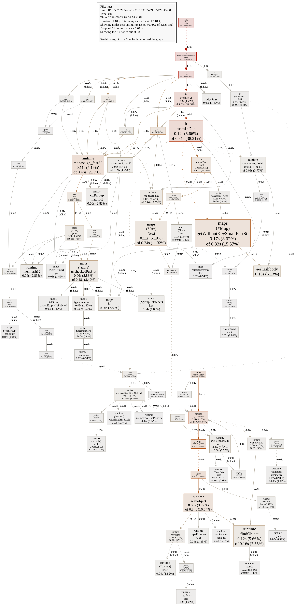
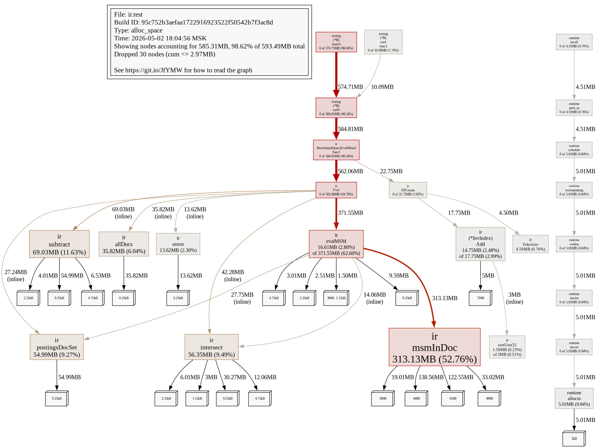
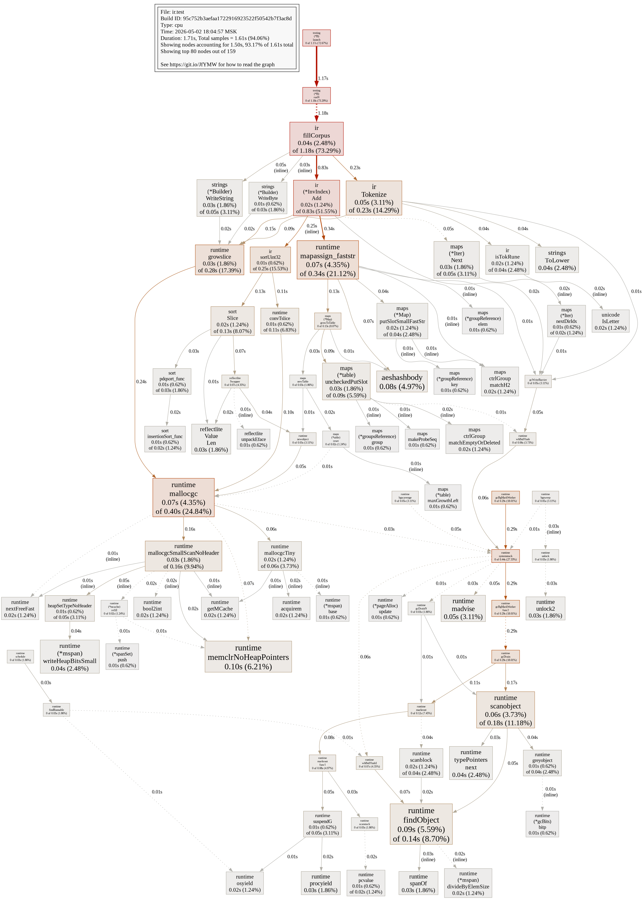
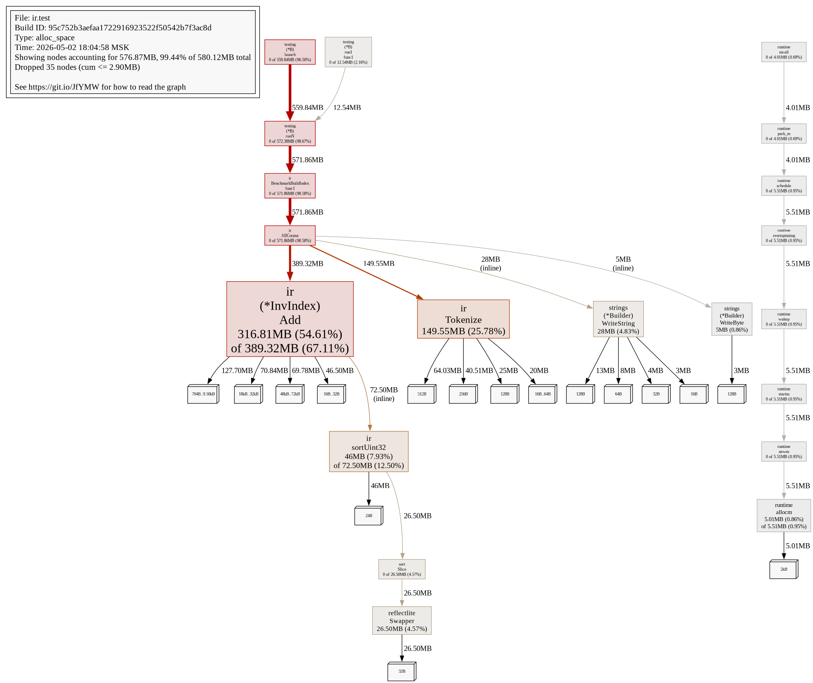

# Лабораторная работа №5 — Обратный индекс, булевы запросы, BM25

**Дисциплина:** Структуры и алгоритмы в базах данных и распределённых системах  
**Тема:** Инвертированный индекс с позициями; операторы **AND / OR / NOT**, **NEAR**, **MSM**, границы документа (**«edge»**); ранжирование **BM25** поверх булева фильтра.

---

## Содержание

1. [Постановка](#1-постановка)
2. [Реализация и язык запросов](#2-реализация-и-язык-запросов)
3. [Методика бенчмарков](#3-методика-бенчмарков)
4. [Результаты и графики](#4-результаты-и-графики)
5. [Тесты и эталон SlowEval](#5-тесты-и-эталон-sloweval)
6. [Профилирование CPU и памяти](#6-профилирование-cpu-и-памяти)
7. [Вывод](#7-вывод)

---

## 1. Постановка

Требуется:

- построить **обратный индекс** по корпусу документов (постинги с **номерами позиций токенов**);
- поддержать булевы операции и расширения из задания: **MSM** (Ordered Window / «мульти-множество» лексем в окне ширины *k*), **NEAR**(*k*, *a*, *b*) — два термина на расстоянии не более *k* позиций, **NOT** с обычной семантикой дополнения множества документов;
- **Граница документа (термин из курса — *edge*, «начало/конец» по позициям после токенизации):**

  | Что хотим в курс. смысле | Предикат в языке запросов | Синоним (буквально «edge», без слова `start` как ключевого имени функции в текстах) |
  |:--------------------------|:--------------------------|:-----------------------------------------------------------------------------------|
  | токен в **первой** позиции документа | `FIRST(term)` | **`EDGE_START(term)`** |
  | токен в **последней** позиции | `LAST(term)` | **`EDGE_END(term)`** |

  То есть документ входит во множество, если нужный термин есть в позиции **0** после токенизации (**первое сопоставление** с левого края строки документа) или только в суффиксе, совпадающем с последним токеном (**конец строки после токенизации**).

  Отдельно от зарезервированной конструкции **`EDGE_*`** литералы слова *start*, *edge* и др. могут использоваться как **обычные токены** в корпусе (если они проходят токенизатор `[a-z0-9]+`); главное решение архитектуры имён именно в том, чтобы **не** использовать зарезервированное ключевое слово вида функции **`START(...)`** — оно режет текстовые вхождения слова «start».
- после булева отбора кандидатов — **BM25**-ранжирование по лексемам из **положительной** части запроса (поддеревья под **`NOT`** в список «запросных» терминов не попадают, см. [`internal/ir/collect.go`](internal/ir/collect.go)).

Токенизация: нижний регистр ASCII, последовательности `[a-z0-9]+` ([`internal/ir/tokenize.go`](internal/ir/tokenize.go)).

---

## 2. Реализация и язык запросов

### Структура кода

| Файл | Назначение |
|:-----|:-----------|
| [`internal/ir/index.go`](internal/ir/index.go) | `InvIndex`, `Doc`, постинги, `df`, добавление документов |
| [`internal/ir/ast.go`](internal/ir/ast.go) | AST: `Term`, `Not`, `And`, `Or`, `Near`, `MSM`, границы |
| [`internal/ir/parse.go`](internal/ir/parse.go) | парсер: `and` / `or` / `not`, скобки, `NEAR (…)`, `MSM (…)`, **`FIRST`**/**`LAST`** и синонимы **`EDGE_START`/`EDGE_END`** |
| [`internal/ir/eval.go`](internal/ir/eval.go) | интерпретация над индексом (пересечения постингов, MSM по событиям в документе) |
| [`internal/ir/scan.go`](internal/ir/scan.go) | **`SlowEval`** — полный проход текстов документа (эталон) |
| [`internal/ir/bm25.go`](internal/ir/bm25.go) | BM25; при отсутствии положительных терминов — сортировка по `DocID` |
| [`internal/ir/search.go`](internal/ir/search.go) | `SearchBoolEval`, `SearchBM25` |

### Примеры синтаксиса

```text
alpha AND beta
(alpha OR gamma) AND NOT delta
NEAR ( 3 , hello , world )
MSM ( 10 , quick , brown , fox )
FIRST(hello) AND LAST(planet)
EDGE_START(hello) AND EDGE_END(planet)
```

Приоритет: **`not`** выше, чем **`and`** и **`or`**; **`and`** сильнее **`or`** (как в типичных DSL). Скобки задают явный порядок.

### BM25

Используются стандартные параметры `k1`, `b` (передаются в `SearchBM25`). Для каждого кандидата считается сумма вкладов по терминам из `PositiveTerms(ast)`; при равенстве оценок — разрешение по возрастанию `DocID`.

---

## 3. Методика бенчмарков

Команды ([`Makefile`](Makefile)):

```bash
make test           # go test ./...
make collect plot   # metrics/raw/*.txt, csv, gnuplot PNG в metrics/plots/
make profile        # два сценария: Eval + построение индекса; *.prof, top, -png и flame graphs
```

- **`BENCH_CORPUS`** — список размеров синтетического корпуса (число документов), по умолчанию `400,2000`.
- Имена подбенчей согласованы с суффиксом `-GOMAXPROCS` в выводе `go test`: `BenchmarkBuildIndex/corpN`, `BenchmarkQueryEvalMixed/idx_N` и `…/scan_N`, чтобы `awk` в `collect` корректно строил `benchmarks.csv`.

Сценарии:

1. **`BenchmarkBuildIndex`** — полная индексация корпуса за одну итерацию (`ns/op`).
2. **`BenchmarkQueryEvalMixed`** — один и тот же тяжёлый запрос через **`Eval`** (индекс) vs **`SlowEval`** (линейный скан текстов):

   `(alpha AND beta) OR MSM(40, gamma, omega) AND NOT FIRST(delta)`.

На машине отчёта: **`goos: linux`**, **`goarch: amd64`**, см. строку `cpu:` в [`metrics/raw/benchmarks.txt`](metrics/raw/benchmarks.txt).

---

## 4. Результаты и графики

### Таблица — агрегат `metrics/raw/benchmarks.csv` (прогон prelude `BENCH_CORPUS=400,2000`)

| bench | режим | документов | iters | ns/op | B/op |
|:------|:------|-----------:|------:|------:|-----:|
| BenchmarkBuildIndex | build | 400 | 319 | 1 861 359 | 1 364 343 |
| BenchmarkBuildIndex | build | 2000 | 51 | 10 471 645 | 7 238 082 |
| BenchmarkQueryEvalMixed | idx | 400 | 2176 | 268 193 | 134 208 |
| BenchmarkQueryEvalMixed | scan | 400 | 2648 | 206 555 | 105 688 |
| BenchmarkQueryEvalMixed | idx | 2000 | 387 | 1 546 409 | 685 218 |
| BenchmarkQueryEvalMixed | scan | 2000 | 508 | 1 193 911 | 511 763 |

**Интерпретация.** Построение индекса масштабируется ожидаемо с ростом корпуса (аллокации словарей и срезов постингов). На **смешанном** запросе с широким окном **MSM** и «дорогими» ветками **`Eval`** на выбранных размерах корпуса **`SlowEval` оказывается быстрее**: линейный скан по коротким синтетическим строкам обходится дешевле, чем комбинация пересечений постингов, вспомогательных `map` и скользящего окна MSM на индексе (см. также профиль CPU в разделе 6). На больших реальных текстах картина может смениться в пользу индекса — это типичный компромисс «алгоритмически лучшая сложность» vs «константы и размер рабочего множества».

#### Рисунок — построение индекса


#### Рисунок — запрос: индекс vs полный скан


---

## 5. Тесты и эталон SlowEval

Пакет [`internal/ir/ir_test.go`](internal/ir/ir_test.go):

- разбор и **`Eval`** для **NEAR**, **NOT**, **`FIRST`** / **`EDGE_START`**;
- **MSM**, границы **`LAST`** / **`EDGE_END`**;
- **`go test -short`**: длинные property-тесты «`SlowEval` vs `Eval`» на случайных корпусах пропускаются;
- упорядочивание **BM25** на фиксированном примере.

---

## 6. Профилирование CPU и памяти

Команда `make profile` (см. [`Makefile`](Makefile)) снимает **две** ключевые нагрузки на корпус из **2000** документов:

1. **`BenchmarkQueryEvalMixed/idx_2000`** — смешанный булев запрос через индекс (NEAR + MSM + FIRST в одной связке из бенча).
2. **`BenchmarkBuildIndex/corp2000`** — полное построение индекса в цикле.

Для каждого случая сохраняются **CPU** и **heap** (`-memprofile`), текстовые `go tool pprof -top`, при наличии **graphviz** — **`go tool pprof [-alloc_space] -png`** в `metrics/plots/`. Скрипт [`scripts/gen_flamegraphs.sh`](scripts/gen_flamegraphs.sh) поднимает `go tool pprof -http`, забирает страницу **`/ui/flamegraph`** в HTML и (если доступен headless Chromium/Chrome) делает PNG — тот же приём, что в **lab-1 / lab-2**.

Сырые файлы: `metrics/profiles/*.prof`, топы [`cpu_query_idx_top.txt`](metrics/profiles/cpu_query_idx_top.txt), [`mem_query_idx_top.txt`](metrics/profiles/mem_query_idx_top.txt) (`-alloc_space`), [`cpu_build_index_top.txt`](metrics/profiles/cpu_build_index_top.txt), [`mem_build_index_top.txt`](metrics/profiles/mem_build_index_top.txt).

### 6.1 CPU — смешанный запрос Eval (corpus 2000)

**Рисунок 6.1 — Flame graph CPU запроса к индексу**


**Рисунок 6.2 — Call graph CPU (`go tool pprof -png`)**



| Компонента | Оценка из top | Интерпретация |
|:-----------|:--------------|:---------------|
| `msmInDoc` | cum ~38% строки топа (~0.81s из ~2.12s wall) | скользящее окно MSM по событиям в документе — доминирующая ветвь нашего кода |
| доступ к **`map`** + GC (`scanobject`, `mapassign`, `Iter.Next`) | много узлов с похожим flat | промежуточные множества и словари в `Eval` порождают нагрузку на рантайм |
| `aeshashbody` | ~6% flat | строковые ключи в map при работе постингов / индекса |

**Вывод:** оптимизация «в лоб» — сокращать аллокации и проходы в **`msmInDoc`** (пул временных буферов, компактнее представление окна счётчиков).

### 6.2 Память (`alloc_space`) — тот же запрос Eval

Общий объём сэмпла в топе профиля: **≈594 MB alloc_space** (агрегируются повторные итерации бенча).

**Рисунок 6.3 — Flame graph памяти (alloc_space)**


**Рисунок 6.4 — Call graph памяти (`go tool pprof -alloc_space -png`)**



| Функция | alloc_space | доля от тотала | Комментарий |
|:--------|------------:|---------------:|:------------|
| `msmInDoc` | ≈313 MB | ≈52.8% | временные структуры окна MSM и обход постингов |
| `subtract` | ≈69 MB | ≈11.6% | подмножество документов для `NOT`-веток |
| `intersect` | ≈56 MB | ≈9.5% | булевы пересечения множеств `doc ID` |
| `postingsDocSet` | ≈55 MB | ≈9.3% | материализация множества из постингов |
| `allDocs` | ≈36 MB | ≈6.0% | основа для дополнений |
| `evalMSM` cum | включает доминантный вклад MSM | см. столбцы выше |

**Вывод:** по аналогии с разделом памяти в **geo/lab-2**: доминирующий **`alloc_space`** — не случайный шум рантайма, а **повторное создание промежуточных множеств документов** на каждом вызове `Eval`. Снижение давления на GC дают переиспользуемые буферы под множества `docID` или, при фиксированном N документов, битовые маски фиксированной длины.

### 6.3 CPU — построение индекса BuildIndex/corp2000

**Рисунок 6.5 — Flame graph CPU построения**


**Рисунок 6.6 — Call graph CPU построения**



В топе: **`fillCorpus` → `Tokenize`**, плюс `mapassign`/аллокатор на пути добавления документа в индекс. Это соответствует дорогому пути **`(*InvIndex).Add`** для каждого токена.

### 6.4 Память (`alloc_space`) — построение индекса

**Рисунок 6.7 — Flame graph памяти построения**


**Рисунок 6.8 — Call graph памяти построения**



| Функция | alloc_space | доля | Комментарий |
|:--------|------------:|-----:|:------------|
| `(*InvIndex).Add` cum | основной вклад (~67% строки топа cum) | вся логика роста индексных структур |
| `Tokenize` | ≈149 MB | ~25.8% | срезы токенов и строковые операции для каждого документа |
| `sortUint32` | ≈72 MB cum | упорядочивание постингов и слияние |
| `strings.Builder`, `reflect.Swapper` | заметно | сборка текстов синтетического документа + сортировка |

Интерактивные HTML тем же профилям: например [`flamegraph_mem_query_idx.html`](metrics/plots/flamegraph_mem_query_idx.html), [`flamegraph_cpu_build_index.html`](metrics/plots/flamegraph_cpu_build_index.html) (полный комплект генерирует `scripts/gen_flamegraphs.sh`).

---

## 7. Вывод

Реализованы обратный индекс с позициями, парсер и вычислитель булевых запросов с **NEAR**, **MSM** и границами документа (понятие *edge* в курсе: **`FIRST`** / **`EDGE_START`** у начала строки после токенизации, **`LAST`** / **`EDGE_END`** у конца), ранжирование **BM25** по положительным терминам. Добавлены бенчи и gnuplot-графики; по **CPU и `alloc_space`** оформлены flame graph + call graph (как в ранних лабораторных) и таблицы с разбором вкладов **`msmInDoc`**, операций множества и **`Add`/`Tokenize`** при построении. На синтетике индекс не обязан обгонять **`SlowEval`** на тяжёлом MSM: видно совпадение картины профиля (**MSM + временные множества**) с наблюдаемыми **`B/op`**.
