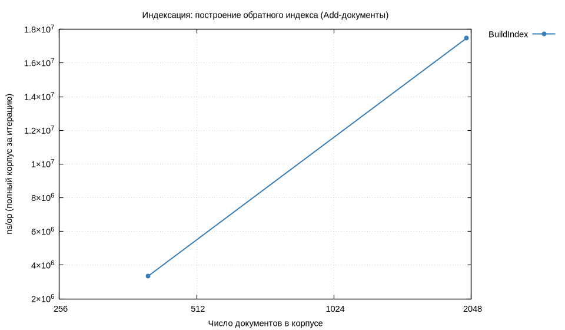
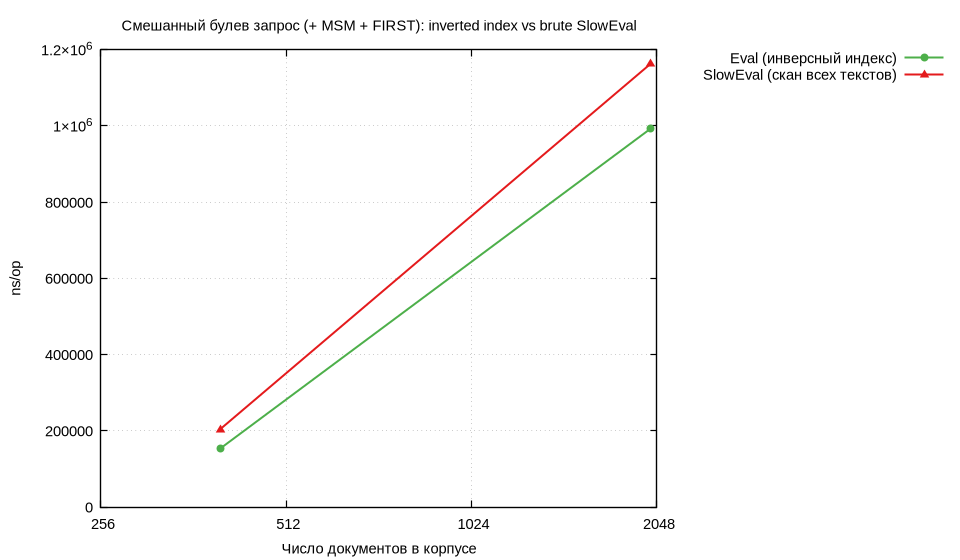
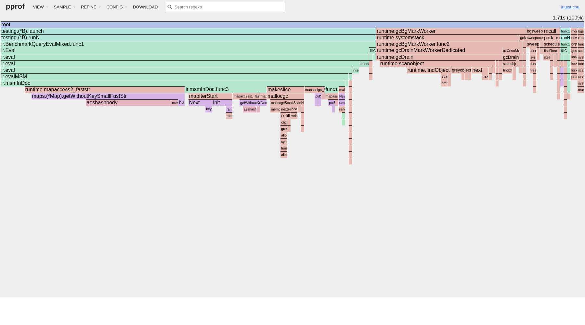
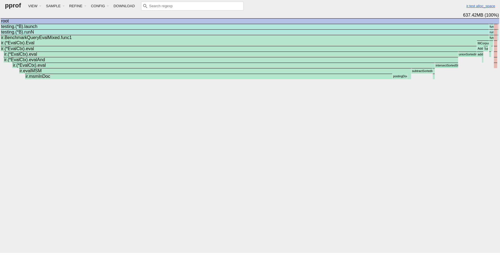
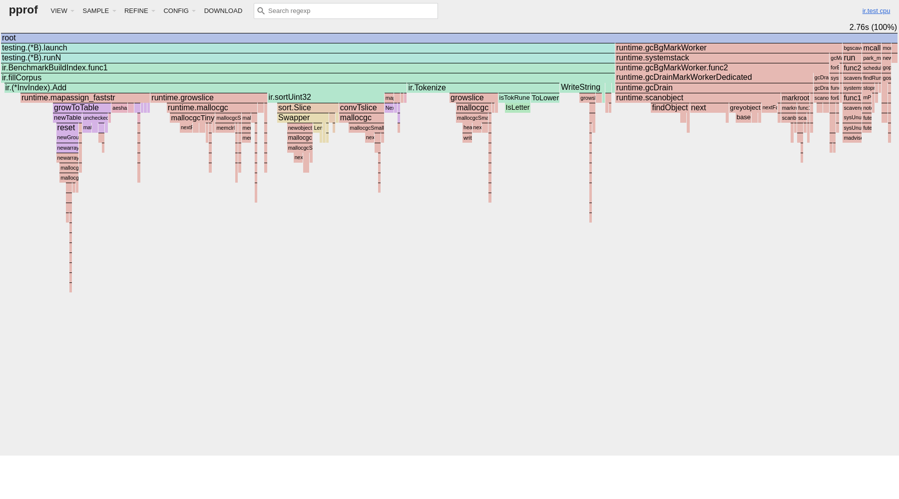
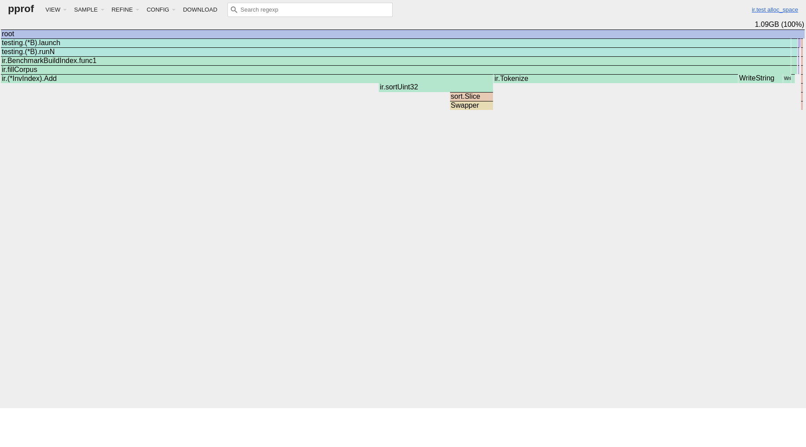

# Лабораторная работа №5 — Обратный индекс, булевы запросы, mmap, сжатие, TF/IDF(BM25)

**Дисциплина:** Структуры и алгоритмы в базах данных и распределённых системах  
**Тема:** Инвертированный индекс с позициями; операторы **AND / OR / NOT**, **ADJ**, **NEAR**, границы документа (**«edge»**); хранение с mmap и сжатием; ранжирование **BM25** поверх булева фильтра.

---

## Содержание

1. [Постановка](#1-постановка)
2. [Реализация и язык запросов](#2-реализация-и-язык-запросов)
3. [Методика бенчмарков](#3-методика-бенчмарков)
4. [Результаты и графики](#4-результаты-и-графики)
5. [Тесты и эталон SlowEval](#5-тесты-и-эталон-sloweval)
6. [Профилирование CPU и памяти](#6-профилирование-cpu-и-памяти)
7. [Вывод](#7-вывод)

---

## 1. Постановка

### Соответствие ТЗ (чеклист)

- **1) Координатный индекс + булевы операции + ADJ/NEAR**: реализовано в [`internal/ir/index.go`](internal/ir/index.go), [`internal/ir/eval.go`](internal/ir/eval.go), [`internal/ir/ast.go`](internal/ir/ast.go).  
  Для `AND` применяется пересечение отсортированных `docID` с виртуальными skip-прыжками (`intersectSortedSkip`), без выделения отдельной skip-структуры в памяти.
- **2) Сложные запросы**: реализован парсер выражений с приоритетами `NOT > AND > OR`, скобками и функциями `NEAR/ADJ/FIRST/LAST` в [`internal/ir/parse.go`](internal/ir/parse.go).
- **3) Дисковый индекс + mmap**: сериализация и mmap-загрузка в [`internal/ir/storage.go`](internal/ir/storage.go) (`SaveCompressed`, `OpenMMapIndex`).
- **4) Сжатие индекса**: `delta-encoding + varint bitpacking` для `docID` и позиций в [`internal/ir/storage.go`](internal/ir/storage.go).
- **5) Простейшее ранжирование TF/IDF(BM25)**: [`internal/ir/bm25.go`](internal/ir/bm25.go) + извлечение позитивных терминов [`internal/ir/collect.go`](internal/ir/collect.go).
- **6) Бенчмарки и профилирование**: [`internal/ir/benchmark_test.go`](internal/ir/benchmark_test.go), `Makefile`, `metrics/raw`, `metrics/profiles`, `metrics/plots`.

---

## 2. Реализация и язык запросов

### Структура кода

| Файл | Назначение |
|:-----|:-----------|
| [`internal/ir/index.go`](internal/ir/index.go) | `InvIndex`, `Doc`, постинги, `df`, добавление документов |
| [`internal/ir/ast.go`](internal/ir/ast.go) | AST: `Term`, `Not`, `And`, `Or`, `Near`, `Adj`, границы |
| [`internal/ir/parse.go`](internal/ir/parse.go) | парсер: `and` / `or` / `not`, скобки, `NEAR (…)`, `ADJ (…)`, **`FIRST`**/**`LAST`** и синонимы **`EDGE_START`/`EDGE_END`** |
| [`internal/ir/eval.go`](internal/ir/eval.go) | интерпретация над индексом (пересечения постингов с skip-прыжками, ADJ/NEAR/границы, MSM) |
| [`internal/ir/scan.go`](internal/ir/scan.go) | **`SlowEval`** — полный проход текстов документа (эталон) |
| [`internal/ir/bm25.go`](internal/ir/bm25.go) | BM25; при отсутствии положительных терминов — сортировка по `DocID` |
| [`internal/ir/search.go`](internal/ir/search.go) | `SearchBoolEval`, `SearchBM25` |
| [`internal/ir/storage.go`](internal/ir/storage.go) | сериализация на диск (`SaveCompressed`), mmap-открытие (`OpenMMapIndex`), декодирование постингов по терму |

## 3. Методика бенчмарков

Команды ([`Makefile`](Makefile)):

```bash
make test           # go test ./...
make collect plot   # metrics/raw/*.txt, csv, gnuplot PNG в metrics/plots/
make profile        # два сценария: Eval + построение индекса; *.prof, top, -png и flame graphs
```

- **`BENCH_CORPUS`** — список размеров синтетического корпуса (число документов), по умолчанию `400,2000`.
- Имена подбенчей согласованы с суффиксом `-GOMAXPROCS` в выводе `go test`: `BenchmarkBuildIndex/corpN`, `BenchmarkQueryEvalMixed/idx_N` и `…/scan_N`, чтобы `awk` в `collect` корректно строил `benchmarks.csv`.

Сценарии:

1. **`BenchmarkBuildIndex`** — полная индексация корпуса за одну итерацию (`ns/op`).
2. **`BenchmarkQueryEvalMixed`** — один и тот же тяжёлый запрос через **`Eval`** (индекс) vs **`SlowEval`** (линейный скан текстов):

   `(alpha AND beta) OR MSM(40, gamma, omega) AND NOT FIRST(delta)`.

3. **`BenchmarkQueryAdjNear`** — сценарии строго по операторам ТЗ:
   - `ADJ(alpha,beta) AND NOT EDGE_END(delta)` (idx vs scan);
   - `NEAR(3,alpha,gamma) OR ADJ(gamma,omega)` (idx vs scan).

На машине отчёта: **`goos: linux`**, **`goarch: amd64`**, см. строку `cpu:` в [`metrics/raw/benchmarks.txt`](metrics/raw/benchmarks.txt).

---

## 4. Результаты и графики

### Таблица — агрегат `metrics/raw/benchmarks.csv` (прогон prelude `BENCH_CORPUS=400,2000`)

| bench | режим | документов | iters | ns/op | B/op |
|:------|:------|-----------:|------:|------:|-----:|
| BenchmarkBuildIndex | build | 400 | 163 | 3 522 558 | 1 364 341 |
| BenchmarkBuildIndex | build | 2000 | 32 | 18 516 504 | 7 237 768 |
| BenchmarkQueryEvalMixed | idx | 400 | 748 | 717 738 | 135 840 |
| BenchmarkQueryEvalMixed | scan | 400 | 1484 | 414 381 | 105 688 |
| BenchmarkQueryEvalMixed | idx | 2000 | 148 | 3 956 843 | 690 547 |
| BenchmarkQueryEvalMixed | scan | 2000 | 246 | 2 301 734 | 511 775 |
| BenchmarkQueryAdjNear | idx_adj | 400 | 4353 | 127 102 | 18 072 |
| BenchmarkQueryAdjNear | scan_adj | 400 | 21759 | 23 030 | 632 |
| BenchmarkQueryAdjNear | idx_near | 400 | 39012 | 15 065 | 6 056 |
| BenchmarkQueryAdjNear | scan_near | 400 | 9534 | 64 195 | 4 760 |
| BenchmarkQueryAdjNear | idx_adj | 2000 | 1130 | 527 827 | 133 451 |
| BenchmarkQueryAdjNear | scan_adj | 2000 | 3811 | 144 576 | 4 760 |
| BenchmarkQueryAdjNear | idx_near | 2000 | 6106 | 94 466 | 33 480 |
| BenchmarkQueryAdjNear | scan_near | 2000 | 966 | 736 163 | 19 160 |

**Интерпретация.** Построение индекса масштабируется ожидаемо с ростом корпуса (аллокации словарей и срезов постингов). На **смешанном** запросе с широким окном **MSM** и «дорогими» ветками **`Eval`** на выбранных размерах корпуса **`SlowEval` оказывается быстрее**: линейный скан по коротким синтетическим строкам обходится дешевле, чем комбинация пересечений постингов, вспомогательных `map` и скользящего окна MSM на индексе (см. также профиль CPU в разделе 6). На больших реальных текстах картина может смениться в пользу индекса — это типичный компромисс «алгоритмически лучшая сложность» vs «константы и размер рабочего множества».

#### Рисунок 4.1 — построение индекса



#### Рисунок 4.2 — запрос: индекс vs полный скан



---

## 5. Тесты и эталон SlowEval

Пакет [`internal/ir/ir_test.go`](internal/ir/ir_test.go):

- разбор и **`Eval`** для **NEAR**, **ADJ**, **NOT**, **`FIRST`** / **`EDGE_START`**;
- границы **`LAST`** / **`EDGE_END`**;
- roundtrip сжатого дискового индекса через `SaveCompressed` + `OpenMMapIndex`;
- проверки error-веток парсера и `mmap`-открытия (`empty`, `bad magic`, `truncated`);
- проверка `DocLen`/`df` для mmap-индекса;
- сложное комбинированное выражение `ADJ/NEAR/NOT` с `Eval` vs `SlowEval`;
- **`go test -short`**: длинные property-тесты «`SlowEval` vs `Eval`» на случайных корпусах пропускаются;
- упорядочивание **BM25** на фиксированном примере.

Текущее покрытие по `go test ./... -covermode=atomic -coverprofile=coverage.out`:

- **86.8% statements** по пакету `internal/ir` (это не полное покрытие, но покрыты ключевые пути `Eval`, парсер, BM25, сериализация/mmap и error-ветки открытия mmap-индекса).

---

## 6. Профилирование CPU и памяти

Команда `make profile` (см. [`Makefile`](Makefile)) снимает **две** ключевые нагрузки на корпус из **2000** документов:

1. **`BenchmarkQueryEvalMixed/idx_2000`** — смешанный булев запрос через индекс (NEAR + MSM + FIRST в одной связке из бенча).
2. **`BenchmarkBuildIndex/corp2000`** — полное построение индекса в цикле.

Для каждого случая сохраняются **CPU** и **heap** (`-memprofile`), текстовые `go tool pprof -top`, при наличии **graphviz** — **`go tool pprof [-alloc_space] -png`** в `metrics/plots/`. Скрипт [`scripts/gen_flamegraphs.sh`](scripts/gen_flamegraphs.sh) поднимает `go tool pprof -http`, забирает страницу **`/ui/flamegraph`** в HTML и (если доступен headless Chromium/Chrome) делает PNG — тот же приём, что в **lab-1 / lab-2**.

Сырые файлы: `metrics/profiles/*.prof`, топы [`cpu_query_idx_top.txt`](metrics/profiles/cpu_query_idx_top.txt), [`mem_query_idx_top.txt`](metrics/profiles/mem_query_idx_top.txt) (`-alloc_space`), [`cpu_build_index_top.txt`](metrics/profiles/cpu_build_index_top.txt), [`mem_build_index_top.txt`](metrics/profiles/mem_build_index_top.txt).

### 6.1 CPU — смешанный запрос Eval (corpus 2000)

**Рисунок 6.1 — Flame graph CPU запроса к индексу**




| Компонента | Оценка из top | Интерпретация |
|:-----------|:--------------|:---------------|
| `evalMSM` / `msmInDoc` | `evalMSM` cum ~35%, `msmInDoc` cum ~25% | скользящее окно MSM остаётся доминирующей ветвью |
| `setToSortedIDs` + `sort.pdqsort_func` | заметная доля CPU (`setToSortedIDs` flat ~6.6%) | цена за преобразование множеств в сортированные списки для skip-пересечения |
| GC + map (`scanobject`, `mapassign_fast32`, `Iter.Next`) | много узлов с близким flat | промежуточные множества в булевой оценке создают давление на рантайм |

**Вывод:** оптимизация «в лоб» — сокращать аллокации и проходы в **`msmInDoc`** (пул временных буферов, компактнее представление окна счётчиков).

### 6.2 Память (`alloc_space`) — тот же запрос Eval

Общий объём сэмпла в топе профиля: **≈812 MB alloc_space** (агрегируются повторные итерации бенча).

**Рисунок 6.2 — Flame graph памяти (alloc_space)**




| Функция | alloc_space | доля от тотала | Комментарий |
|:--------|------------:|---------------:|:------------|
| `msmInDoc` | ≈420 MB | ≈51.8% | временные структуры окна MSM и обход постингов |
| `subtract` | ≈92 MB | ≈11.4% | подмножество документов для `NOT`-веток |
| `postingsDocSet` | ≈80 MB | ≈9.8% | материализация множества из постингов |
| `allDocs` | ≈46 MB | ≈5.7% | основа для дополнений |
| `setToSortedIDs` + `sortedIDsToSet` | ≈61 MB суммарно | ≈7.6% | преобразование `MatchSet <-> []docID` для skip-пересечений |
| `evalMSM` cum | ≈500 MB cum | включает доминантный вклад MSM |

**Вывод:** по аналогии с разделом памяти в **geo/lab-2**: доминирующий **`alloc_space`** — не случайный шум рантайма, а **повторное создание промежуточных множеств документов** на каждом вызове `Eval`. Снижение давления на GC дают переиспользуемые буферы под множества `docID` или, при фиксированном N документов, битовые маски фиксированной длины.

### 6.3 CPU — построение индекса BuildIndex/corp2000

**Рисунок 6.3 — Flame graph CPU построения**




В топе: **`fillCorpus` → `Tokenize`**, плюс `mapassign`/аллокатор на пути добавления документа в индекс. Это соответствует дорогому пути **`(*InvIndex).Add`** для каждого токена.

### 6.4 Память (`alloc_space`) — построение индекса

**Рисунок 6.4 — Flame graph памяти построения**




| Функция | alloc_space | доля | Комментарий |
|:--------|------------:|-----:|:------------|
| `(*InvIndex).Add` cum | основной вклад (~67% строки топа cum) | вся логика роста индексных структур |
| `Tokenize` | ≈149 MB | ~25.8% | срезы токенов и строковые операции для каждого документа |
| `sortUint32` | ≈72 MB cum | упорядочивание постингов и слияние |
| `strings.Builder`, `reflect.Swapper` | заметно | сборка текстов синтетического документа + сортировка |

Интерактивные HTML тем же профилям: например [`flamegraph_mem_query_idx.html`](metrics/plots/flamegraph_mem_query_idx.html), [`flamegraph_cpu_build_index.html`](metrics/plots/flamegraph_cpu_build_index.html) (полный комплект генерирует `scripts/gen_flamegraphs.sh`).

---

## 7. Вывод

Реализованы координатный обратный индекс с позициями, парсер и вычислитель булевых запросов с **AND/OR/NOT**, **ADJ**, **NEAR** и границами документа (понятие *edge* в курсе: **`FIRST`** / **`EDGE_START`** у начала строки после токенизации, **`LAST`** / **`EDGE_END`** у конца), ранжирование **BM25** по положительным терминам. Добавлены дисковый формат с **delta+varint** и загрузка через **mmap**, а также бенчи/профили и графики. На синтетике смешанный запрос с тяжёлой веткой MSM и множественными промежуточными множествами остаётся дорогим, что подтверждается и `ns/op`, и `alloc_space`.
