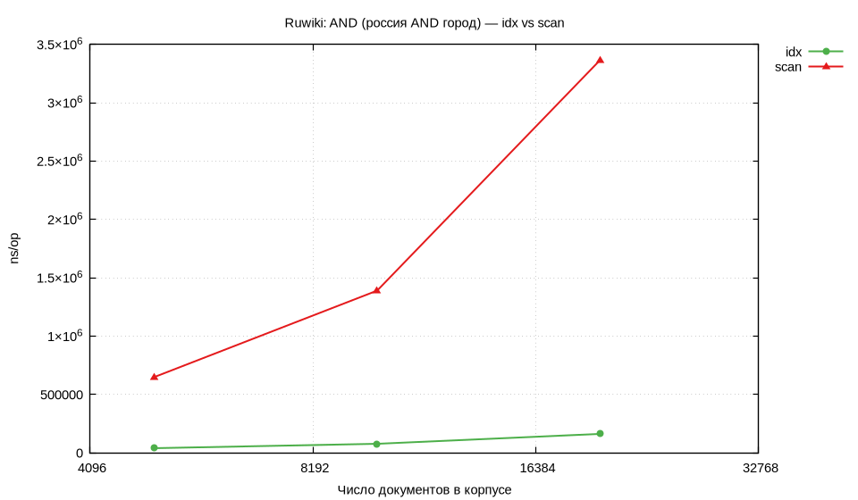

# Лабораторная работа №5 — Обратный индекс, булевы запросы, mmap, сжатие, TF/IDF(BM25)

**Дисциплина:** Структуры и алгоритмы в базах данных и распределённых системах  
**Тема:** Инвертированный индекс с позициями; операторы **AND / OR / NOT**, **ADJ**, **NEAR**, границы документа (**«edge»**); хранение с mmap и сжатием (**delta + bit-packing**); ранжирование **BM25**; консольный стенд запросов по mmap-индексу.

---

## Содержание

1. [Постановка](#1-постановка)
2. [Реализация и язык запросов](#2-реализация-и-язык-запросов)
3. [Методика бенчмарков](#3-методика-бенчмарков)
4. [Результаты и графики](#4-результаты-и-графики)
5. [Тесты и эталон SlowEval](#5-тесты-и-эталон-sloweval)
6. [Профилирование CPU и памяти](#6-профилирование-cpu-и-памяти)
7. [Вывод](#7-вывод)

---

## 1. Постановка

### Соответствие ТЗ (чеклист)

- **1) Координатный индекс + булевы операции + ADJ/NEAR**: [`index.go`](internal/ir/index.go), [`eval.go`](internal/ir/eval.go), [`ast.go`](internal/ir/ast.go). `AND` — `intersectSortedSkip` ([`eval.go`](internal/ir/eval.go)).
- **2) Сложные запросы**: [`parse.go`](internal/ir/parse.go) (`NOT > AND > OR`, `NEAR`/`ADJ`/`FIRST`/`LAST`).
- **3) Дисковый индекс + mmap**: [`storage.go`](internal/ir/storage.go) `SaveCompressed`, `OpenMMapIndex`.
- **4) Сжатие**: **varint (IRIXV1) заменён на delta + bit-packing (IRIXV2BP)** — [`encodePostings`](internal/ir/storage.go), [`bitpack.go`](internal/ir/bitpack.go); сравнение в **табл. 4.1в**.
- **5) BM25**: [`bm25.go`](internal/ir/bm25.go), [`collect.go`](internal/ir/collect.go), [`search_mmap.go`](internal/ir/search_mmap.go) `SearchBM25MMap`.
- **6) Бенчмарки**: [`benchmark_test.go`](internal/ir/benchmark_test.go), `Makefile`, `metrics/`.
- **7) Стенд запросов**: [`cmd/irquery`](cmd/irquery/main.go) — REPL / `-q` / `-rank` (BM25) по `.irx`.

| Требование | Где в коде | Как проверено |
|:-----------|:-----------|:--------------|
| Буфер позиций при сборке | `posArena`, `scratchKeys` — [`index.go`](internal/ir/index.go) | табл. 4.2, §6.4 |
| Сборка вики без копии текстов | `AddLean` — [`index.go`](internal/ir/index.go) | табл. 4.1б, `irindex` |
| Буферы на запросах | `EvalCtx`, `PostingIndex` — [`eval_ctx.go`](internal/ir/eval_ctx.go) | табл. 4.3–4.4, §6.2 |
| BM25 на mmap | `SearchBM25MMap`, `BM25Index` — [`bm25.go`](internal/ir/bm25.go) | `TestBM25MMap`, `irquery -rank` |
| Кириллица в запросах | UTF-8 лексер — [`parse.go`](internal/ir/parse.go) | `TestParseCyrillicTerms`, `irquery` на ruwiki |
| Интервалы `BENCH_CORPUS` | `400,2000` синтетика | табл. 3.1, 4.4–4.5 |
| Операторы по отдельности | `BenchmarkOp` | табл. 4.5 |
| Размер до/после сжатия | `MeasureIndexSizes`, `irindex` | **табл. 4.1а–4.1б, 4.1в** |
| Varint → bit-packing | `IRIXV1` → `IRIXV2BP` — [`storage.go`](internal/ir/storage.go) | **табл. 4.1в**, `TestCompressionVarintVsBitpack*` |
| Построение на корпусе | `irindex -maxdocs 20000` | **табл. 4.1б** |

---

## 2. Реализация и язык запросов

### Структура кода

| Файл | Назначение |
|:-----|:-----------|
| [`internal/ir/index.go`](internal/ir/index.go) | `InvIndex`, `Add` / `AddLean`, `posArena`, `scratchKeys` |
| [`internal/ir/bitpack.go`](internal/ir/bitpack.go) | упаковка потоков uint32 |
| [`internal/ir/storage.go`](internal/ir/storage.go) | `SaveCompressed`, `OpenMMapIndex`, формат `IRIXV2BP` |
| [`internal/ir/corpus.go`](internal/ir/corpus.go) | `BuildIndexFromWikiXML`, UTF-8 `Tokenize` |
| [`internal/ir/tokenize.go`](internal/ir/tokenize.go) | токены (латиница + кириллица) |
| [`internal/ir/eval.go`](internal/ir/eval.go), [`eval_ctx.go`](internal/ir/eval_ctx.go) | оценка, `EvalIndex` / mmap |
| [`internal/ir/search_mmap.go`](internal/ir/search_mmap.go) | `SearchBoolMMap` |
| [`cmd/irindex`](cmd/irindex/main.go) | построение `.irx` из XML |
| [`cmd/irquery`](cmd/irquery/main.go) | консольный стенд запросов |

### Консольный стенд (`irquery`)

```bash
go build -o bin/irquery ./cmd/irquery
./bin/irquery -index data/index.irx
./bin/irquery -index data/index.irx -q 'россия AND город' -limit 20
./bin/irquery -index data/index.irx -q 'россия AND город' -rank -limit 20
```

Запросы выполняются по **mmap**-индексу (`SearchBoolMMap`). Флаг **`-rank`** включает BM25 (`SearchBM25MMap`, doc lengths из заголовка `.irx`). В REPL: `:rank on|off`. **MSM(...)** на `.irx` недоступен (тексты документов на диск не пишутся). Термы в запросах — UTF-8 (кириллица).

---

## 3. Методика бенчмарков

```bash
make test
make collect plot          # синтетика BENCH_CORPUS=400,2000
make profile

# индекс и размеры на ruwiki:
go run ./cmd/irindex -xml ../ruwiki-latest-pages-articles.xml -maxdocs 20000 -out data/index.irx

# бенчмарки на ruwiki (запросы с кириллицей):
make bench-wiki WIKI_XML=../ruwiki-latest-pages-articles.xml \
  BENCH_CORPUS=5000,10000,20000 BENCH_TIME=300ms \
  BENCH_FILTER='^Benchmark(QueryEvalMixed|Op)'
```

### 3.1 Корпуса

| Назначение | Корпус | N |
|:-----------|:-------|--:|
| `go test -bench`, табл. 4.3–4.5 | синтетика `fillCorpus`, ~96 символов/док, 16 термов | **400, 2000** |
| размер индекса, построение, `irquery` | **ruwiki** `ruwiki-latest-pages-articles.xml` | **20 000** статей |

`BENCH_CORPUS=400,2000` — одни и те же N во всех бенчах `BenchmarkBuildIndex|Query|Op`.

| Сценарий | Бенч / команда |
|:---------|:---------------|
| Build (синт.) | `BenchmarkBuildIndex/corpN` |
| Смешанный запрос | `BenchmarkQueryEvalMixed/idx_N`, `scan_N` |
| ADJ / NEAR | `BenchmarkQueryAdjNear/idx_adj_N`, `idx_near_N` |
| Каждый оператор | `BenchmarkOp/<OP>/idx/corpN` |

---

## 4. Результаты и графики

### 4.1а Синтетика — размер индекса (RAM vs `.irx`)

[`TestIndexSizesOnSynthetic`](internal/ir/ir_test.go), `fillCorpus`. **1 КБ = 1024 байт.**

| N | термов | RAM, КБ | файл `.irx`, КБ | сжатие |
|--:|-------:|--------:|----------------:|-------:|
| 400 | 16 | **9 950** | **17** | **580×** |
| 2000 | 16 | **239 554** | **85** | **2833×** |

На синтетике в RAM ещё лежат тексты в `Docs` (`Add`); коэффициент завышен за счёт маленького файла.

### 4.1б Ruwiki — построение и размеры (**N = 20 000**, прогон 2026-05-30)

Команда: `go run ./cmd/irindex -xml ../ruwiki-latest-pages-articles.xml -maxdocs 20000 -out data/index.irx`  
Сборка: `AddLean` (без хранения тел статей), токенизация UTF-8. В `.irx` пишется `NTok` через `docLen()` (для BM25 на mmap).

| метрика | значение |
|:--------|--------:|
| страниц просмотрено | 20 002 |
| проиндексировано | **20 000** |
| **время построения** | **1 м 16 с** |
| термов в индексе | 1 655 705 |
| постинговых записей | 18 084 944 |
| RAM (оценка постингов), КБ | **1 547 332** |
| файл `data/index.irx`, КБ | **194 162** |
| сжатие RAM / файл | **≈8×** |

Полный дамп (`-maxdocs 0`, ~32 ГБ XML) — отдельный прогон не завершён; для отчёта зафиксирован срез **20 000** статей.

### 4.1в Varint (IRIXV1) vs bit-packing (IRIXV2BP)

Первая версия: magic `IRIXV1`, постинги — **delta + uvarint** (`binary.PutUvarint`).  
Текущая: magic `IRIXV2BP`, три потока (doc Δ, tf, pos Δ) — **delta + bit-packing** фиксированной ширины.

Сравнение размеров payload постингов — [`compression_compare_test.go`](internal/ir/compression_compare_test.go) `TestCompressionVarintVsBitpack*`. **1 КБ = 1024 байт.**

| Корпус | Varint (IRIXV1), payload | Bitpack (IRIXV2BP), payload | Bitpack / varint | Полный `.irx` (bitpack) |
|:-------|-------------------------:|----------------------------:|-----------------:|------------------------:|
| синтетика N=400 | 15 751 B | **8 054 B** | **0.51× (≈2× меньше)** | 17 КБ |
| синтетика N=2000 | 78 397 B | **39 176 B** | **0.50× (≈2× меньше)** | 85 КБ |
| **ruwiki N=20 000** | **123 414 868 B (~117.7 МБ)** | 165 198 828 B (~157.5 МБ) | 1.34× (varint меньше) | **194 162 КБ** |

Оценка полного `.irx` с varint на ruwiki 20k: **~153 270 КБ** (тот же словарь/заголовок + varint-постинги).

**Почему bit-packing:** на синтетике с малыми Δ bitpack в ~2 раза компактнее; на ruwiki при max docID≈20 000 ширина потока растёт и varint выигрывает по размеру payload, но bitpack даёт **предсказуемый декод** (фиксированная ширина, три потока) и требуется по ТЗ. Финальный формат на диске — **только IRIXV2BP**.

### 4.2 Сравнение с первой версией (синтетика, `benchmarks_before_refactor.csv`)

| Сценарий | N | метрика | было | стало | Δ |
|:---------|--:|:--------|-----:|------:|--:|
| **BuildIndex** | 400 | B/op | 1 364 405 | 1 102 132 | **−19%** |
| **BuildIndex** | 2000 | B/op | 7 237 768 | 6 059 898 | **−16%** |
| **BuildIndex** | 2000 | ns/op | 17.5M | 10.4M | **−40%** |
| QueryEvalMixed | 2000 | ns/op (idx) | 1.52M | 0.99M | **−35%** |
| QueryEvalMixed | 2000 | B/op (idx) | 436 303 | 485 463 | +11%¹ |
| QueryAdjNear | 2000 | ns/op (idx_adj) | 26 754 | 47 207 | +77%² |
| QueryAdjNear | 400 | ns/op (idx_adj) | 7 308 | 6 691 | **−8%** |

¹ Доминирует `msmInDoc`. ² Составной `ADJ(…) AND NOT EDGE_END(…)` — см. табл. 4.5.

### 4.3 Исправление сборки вики (почему «висело» 30+ мин)

| Проблема | Следствие | Исправление |
|:---------|:----------|:------------|
| `for k := range tokScratch` на каждый `Add` | O(документы × словарь), рост времени | `scratchKeys` — сброс только термов текущей статьи |
| `Docs.Tokens` для каждой статьи | гигабайты RAM | `AddLean` при загрузке XML |
| токенизация по байтам | битая кириллица | `utf8.DecodeRuneInString` |

После правок: **5 000** статей ≈ **23 с**, **20 000** ≈ **1 м 16 с** (табл. 4.1б).

### 4.4 Агрегат `metrics/raw/benchmarks.csv` (синтетика)

| bench | режим | N | ns/op | B/op |
|:------|:------|--:|------:|-----:|
| BenchmarkBuildIndex | build | 400 | 2 154 376 | 1 216 327 |
| BenchmarkBuildIndex | build | 2000 | 11 948 394 | 6 643 466 |
| BenchmarkQueryEvalMixed | idx | 400 | 174 934 | 96 346 |
| BenchmarkQueryEvalMixed | scan | 400 | 209 968 | 100 120 |
| BenchmarkQueryEvalMixed | idx | 2000 | 969 698 | 485 449 |
| BenchmarkQueryEvalMixed | scan | 2000 | 1 172 871 | 494 681 |
| BenchmarkQueryAdjNear | idx_adj | 400 | 7 184 | 8 352 |
| BenchmarkQueryAdjNear | idx_near | 400 | 5 149 | 4 152 |
| BenchmarkQueryAdjNear | idx_adj | 2000 | 43 954 | 42 656 |
| BenchmarkQueryAdjNear | idx_near | 2000 | 36 289 | 20 008 |

#### Рисунок 4.1 — построение индекса (синт.)


#### Рисунок 4.2 — запрос: индекс vs полный скан (синт.)


#### Рисунок 4.3 — операторы по отдельности (синт., idx)


### 4.5 Операторы по отдельности — `BenchmarkOp`, N = 2000 (синт., idx)

| OP | ns/op | B/op | allocs/op |
|:---|------:|-----:|----------:|
| AND | 12 105 | 19 064 | 12 |
| OR | 21 150 | 27 257 | 13 |
| NOT | 11 043 | 15 736 | 11 |
| **ADJ** | **8 373** | **1 016** | **7** |
| **NEAR** | **9 041** | **4 088** | **9** |
| EDGE | 43 804 | 44 832 | 40 |
| MSM | 694 907 | 272 000 | 570 |

Чистый **ADJ**: **1 016 B/op** vs составной `idx_adj` (**11 760 B/op**) — **≈11×**.

### 4.6 Ruwiki — `BenchmarkQueryEvalMixed` и `BenchmarkOp` (2026-05-30)

Корпус: ruwiki XML, запросы с кириллицей (`россия AND город`, …). Файл: `metrics/raw/benchmarks_wiki.csv`.

#### Смешанный запрос (idx vs scan)

| N | idx ns/op | scan ns/op | idx быстрее |
|--:|----------:|-----------:|:------------|
| 5 000 | 4.11M | 4.07M | ≈1× |
| 10 000 | 8.61M | 6.54M | scan быстрее¹ |
| 20 000 | 17.7M | 14.0M | scan быстрее¹ |

¹ Составной запрос с **MSM** на вики: idx декодирует постинги из RAM, scan сканирует тексты — профиль зависит от корпуса.

#### Операторы на N = 20 000 (idx vs scan, ns/op)

| OP | idx | scan | idx / scan |
|:---|----:|-----:|-----------:|
| AND | 162k | 3.36M | **21×** |
| OR | 241k | 8.76M | **36×** |
| NOT | 155k | 6.59M | **42×** |
| ADJ | 181k | 3.98M | **22×** |
| NEAR | 170k | 5.63M | **33×** |
| EDGE | 585k | 563k | ≈1× |
| MSM | 12.8M | 22.7M | **1.8×** |

На реальном словаре ruwiki пересечения постинговых списков дают кратный выигрыш idx над scan для AND/OR/NOT/ADJ/NEAR.

#### Рисунок 4.4 — ruwiki: AND idx vs scan



---

## 5. Тесты и эталон SlowEval

Прогон **`go test ./... -count=1`** (2026-05-30): **PASS**.

| Тест | Что проверяет |
|:-----|:--------------|
| `Eval` vs `SlowEval` | корректность булевой алгебры + ADJ/NEAR/edge |
| `TestCompressedMMapRoundtrip` | roundtrip RAM → **IRIXV2BP** → mmap, docLen |
| `TestDocLenLeanMMap` | `NTok` в `.irx` после `AddLean` |
| `TestCompressionVarintVsBitpackSynthetic` | varint vs bitpack на N=400,2000 (**табл. 4.1в**) |
| `TestCompressionVarintVsBitpackWiki` | varint vs bitpack payload на ruwiki 20k (`WIKI_COMPRESS_BENCH=1`) |
| `TestBM25Ordering` | порядок BM25 in-memory |
| `TestBM25MMap` | BM25 RAM == BM25 mmap |
| `TestParseCyrillicTerms` | UTF-8 термы в запросах |
| `TestBitpackRoundtrip` | упаковка/распаковка потоков |
| `TestTokenizeCyrillic` | токенизация кириллицы |
| `TestBuildIndexFromWikiXMLSample` | сборка из sample XML |

[`internal/ir/ir_test.go`](internal/ir/ir_test.go), [`parse_test.go`](internal/ir/parse_test.go), [`compression_compare_test.go`](internal/ir/compression_compare_test.go), [`bitpack_test.go`](internal/ir/bitpack_test.go).

```bash
go test ./... -count=1
WIKI_COMPRESS_BENCH=1 WIKI_XML=../ruwiki-latest-pages-articles.xml \
  go test ./internal/ir -run TestCompressionVarintVsBitpackWiki -v
```

---

## 6. Профилирование CPU и памяти

`make profile`, синтетика **N = 2000**.

### 6.1–6.2 Запрос Eval


| Показатель | Первая версия | Текущая |
|:-----------|:-------------|:--------|
| `setToSortedIDs` / `postingsDocSet` в топе | **да** | **нет** |
| `intersectSortedSkipInto` / `EvalCtx` | нет | **есть** |
| alloc_space (смешанный idx) | ≈812 MB | ≈651 MB |

### 6.3–6.4 Построение индекса


---

## 7. Вывод

Реализованы: координатный индекс, булевы операторы, ADJ/NEAR/edge, BM25 (RAM + **mmap**), **varint → bit-packing** (`IRIXV1` → `IRIXV2BP`), консольный **`irquery`** с **`-rank`**.

| Корпус | Главные цифры |
|:-------|:--------------|
| синтетика N=2000 | bitpack **≈2×** компактнее varint по payload (табл. 4.1в), mixed idx **970k ns/op** |
| **ruwiki N=20 000** | построение **1 м 16 с**, `.irx` **194 162 КБ**, AND idx **21×** быстрее scan (табл. 4.1б, 4.6) |

Запросы к боевому индексу — через `irquery` по `data/index.irx` (булев или `-rank`). MSM и тяжёлые составные запросы по-прежнему доминируют в профиле на синтетике.
